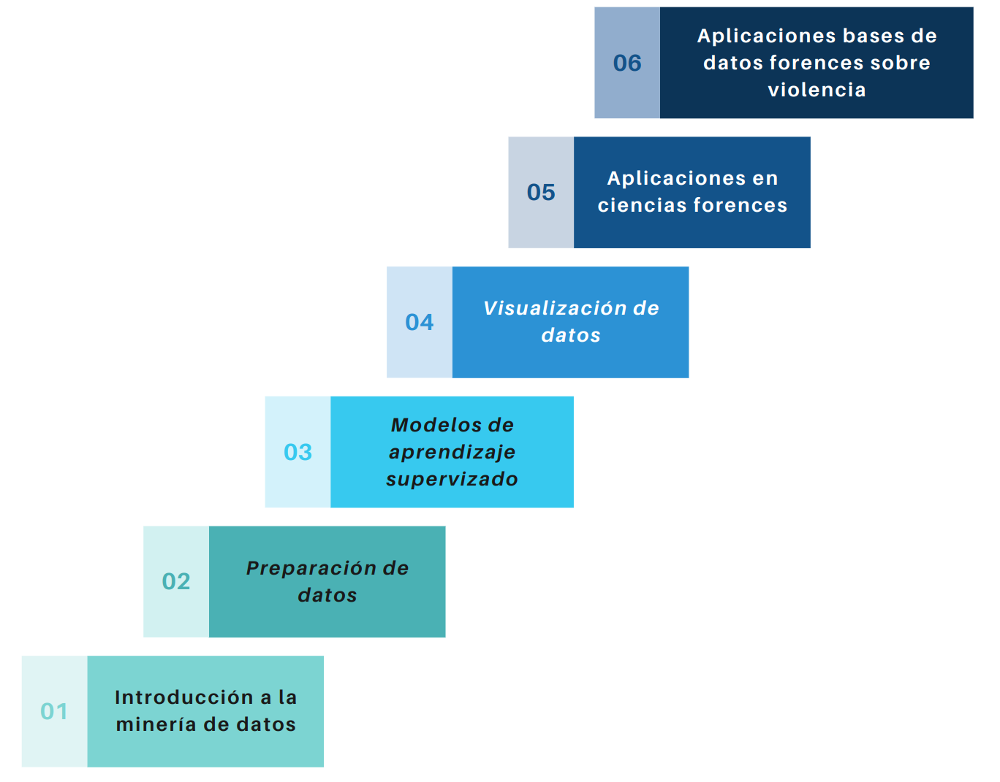

---
output:
  html_document:
    toc: no
    toc_depth: 2
    toc_float: yes
    code_folding: hide
    css: style.css
---


```{r setup, include=FALSE}
knitr::opts_chunk$set(echo = TRUE, comment = NA)

c1 ="#3B566E"  # azul oscuro- color primario 
c2 ="#6487A5"  # azul claro- color secundario
c3 ="#2ED199"  # verdeclaro - color terciario
c4 ="#F2F2F2"  # gris muy claro - color texto
c5 ="#8DA9C4"  # azul claro 
c6= "#04BA80"  # verde claro
c7= "#0E9183"  # verde oscuro
```


```{r, echo=FALSE, out.width="100%", fig.align = "center"}

```


<br/><br/>


```{r, echo=FALSE, out.width="60%", fig.align = "center"}

```


<br/><br/>


## <span style="color:#0E9183">**Unidad 1: **</span> 

### <span style="color:#0E9183">**Introducción a la minería de datos**</span>

* **Conceptos básicos Mineria de Datos y Aprendizaje Automático**

* **Aplicaciones de Minería de Datos**

<br/><br/>

## <span style="color:#0E9183"> **Unidad 2: **</span>  

### <span style="color:#0E9183">**Preparación de datos**</span>


* **Limpieza de datos**
* **Integración y transformación  de datos**
* **Análisis exploratorio de datos**
* **Ejercicios sobre el modelo de bases de datos del Instituto de medicina legal. Centro de referencia sobre violencia - CNRV **

<br/><br/>

## <span style="color:#0E9183"> **Unidad 3: **</span>  

### <span style="color:#0E9183"> **Modelos de aprendizaje supervizado**</span>

* **Regresión lineal**
* **Árboles de decisión**
* **Random Forest**
* **Support Vector Machines (SVM) y no supervizado**
* **Agrupamiento (Clustering)**
* **Reducción de dimensionalidad**

<br/><br/>

### <span style="color:#0E9183">**Unidad 4: **</span>  

### <span style="color:#0E9183">**Visalización de datos**</span>

* **Herramientas de visualización de dato**
* **Gráficos básicos**
* **Tableros**

<br/><br/>

## <span style="color:#0E9183">**Unidad 5: **</span>  

### <span style="color:#0E9183">**Aplicaciones en ciencia forences**</span>

* **Análisis de causa de muertes **
* **Predicción de lesiones en casos de accidentes**
* **Identificación de patrones en casos criminales**

<br/><br/>

## <span style="color:#0E9183">**Unidad 6:**</span>  

### <span style="color:#0E9183"> **Aplicaciones prácticas de los conceptos aprendidos a bases de datos forenses sobre violencia**</span>

* **Uso de herramientas como Python y R para ilistrar los conceptos y aplicaciones a bases de datos de vilencia**
* **Introducción a R**
* **Introducción a Python**


<br/><br/>