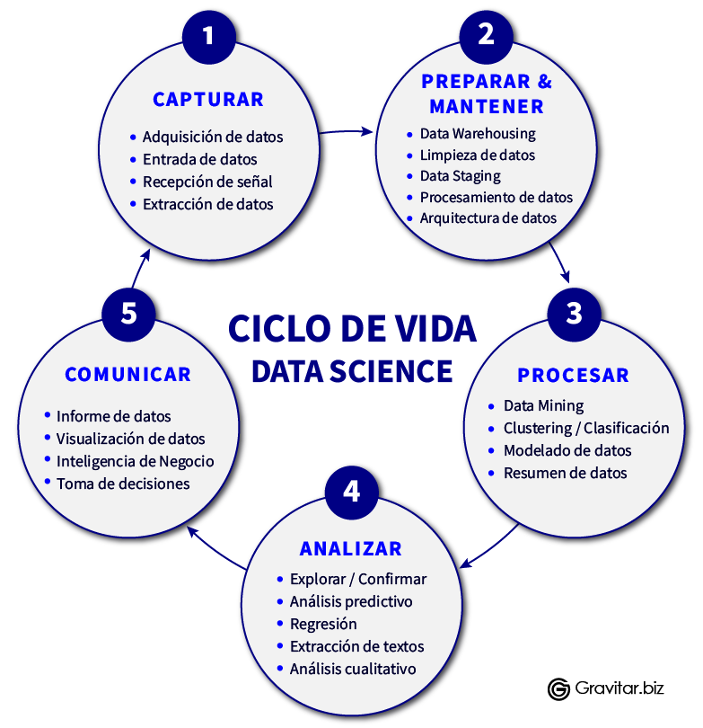
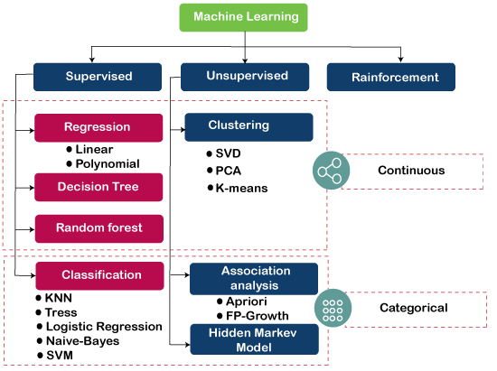
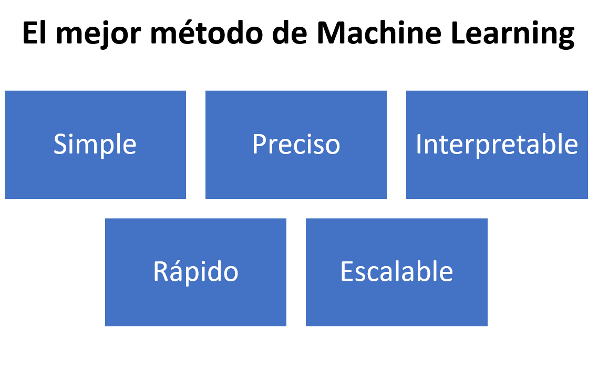

<br/><br/>

```{r setup, include=FALSE}
knitr::opts_chunk$set(echo = TRUE, comment = NA)

# paleta de colores

c1 ="#3B566E"  # azul oscuro- color primario 
c2 ="#6487A5"  # azul claro- color secundario
c3 ="#2ED199"  # verdeclaro - color terciario
c4 ="#F2F2F2"  # gris muy claro - color texto
c5 ="#8DA9C4"  # azul claro 
c6= "#04BA80"  # verde claro
c7= "#0E9183"  # verde oscuro
```


<br/><br/>


# <span style="color:#0E9183">**Mineria de datos y aprendizaje automático**</span>


```{r, echo=FALSE, out.width="100%", fig.align = "center"}

```


<br/>

La ciencia de datos (data science) es una disciplina que permite convertir datos sin procesar en entendimiento, comprensión y conocimiento.  El objetivo de este seminario es motivar el aprendizaje de las **herramientas** más importantes para hacer ciencia de datos, como lo son la **mineria de datos** y el **aprendizaje automático**.


<br/>


```{r, echo=FALSE, out.width="60%", fig.align = "center"}

```


<br/><br/>

# <span style="color:#0E9183">**Mineria de datos (data mining)**</span>

<br/>

## <span style="color:#0E9183">**Minería de datos vs big data**</span>

Para poder hablar de minería de datos es necesario que exista el big data, pero no son lo mismo. El **data mining** también se conoce como **exploración de datos** y consiste en las técnicas que permiten analizar el grueso de la información para detectar **patrones de conducta y tendencias** que ayuden a las instituciones a tomar decisiones con base a esa información que permanecía escondida.

Los proyectos de data mining se ejecutan casi siempre en las siguientes fases:

* Definición del objetivo

* Identificación de los datos necesarios

* Formulación y pretratamiento

* Modelado

* Entrenamiento y evaluación

* Verificación y explotación

<br/><br/>

En cambio el **big data** es el término genérico utilizado para referirse al trabajo con **grandes cantidades** de información que proviene de diversas fuentes. La tecnología big data es capaz de localizar, capturar, almacenar y gestionar los datos, de manera que se pueda sacar un rendimiento de ellos.

<br/>

Los analistas de datos indican que el big data cumple con las características:

* La inmensa cantidad de datos a analizar es la principal cualidad del big data.
* La información se genera a gran velocidad, lo que propicia que muchos datos se queden desfasados en poco tiempo.
* La proveniencia de la información es muy heterogénea, pudiendo llegar desde redes sociales, dispositivos electrónicos, bases de datos, etc.
* Mucha de la información obtenida no será verdadera. Por ello, es importante contar con herramientas de verificación competentes.
* El rendimiento que se les pueda sacar a todos esos datos, es decir, la capacidad de transformarlos en algo productivo.

<br/><br/>

## <span style="color:#0E9183">**Diferencias**</span>

- El data mining implica una vista cercana sobre los datos, mientras que en el big data se ocupa de una exploración general de esos datos.

- La minería se focaliza solamente en un tipo de datos, por ejemplo los estructurados, mientras que el big data puede trabajar con todo tipo de datos a la vez.

- Data mining es una herramienta de vital importancia para desenterrar información que se encuentra oculta en grandes cantidades de datos. Los datos que se manejan en la minería pueden ser tanto grandes como pequeños, sin embargo, el big data se relaciona más con los procesos de tratamiento voluminoso de datos.


<br/><br/>

<div class="content-box-blue">

## <span style="color:#0E9183">**Conclusión**</span> 

Data mining y big data utilizan diferentes procedimientos para manejar la información que analizan, pero son procesos complementarios más que antagónicos. Ambos tienen como objetivo transformar una enorme cantidad de datos en información relevantedentro de las instituciones.

</div>


<br/><br/>

## <span style="color:#0E9183">**Aprendizaje automático (machine learning)**</span>

<br/>

Desde hace algunos años, el aprendizaje automático (ML), junto con la inteligencia artificial (IA) y el aprendizaje profundo (Dl) están revolucionado todas las áreas del conocimiento.

Este campo ha experimentado un enorme crecimiento gracias al desarrollo computacional y complementan los enfoques estadísticos clásicos basados en probabilidad.

<br/>


```{r, echo=FALSE, out.width="70%", fig.align = "center"}
knitr::include_graphics("img/IA2a.png")
```


<br/>

El aprendizaje automático provee a los sistemas computacionales (programas y algoritmos) la habilidad para aprender y mejorar automáticamente a partir de los conjuntos de datos específicos.

En síntesis, el objetivo del aprendizaje automático es hacer “buenos” modelos predictivos para “nuevos” datos.

<br/>

En el aprendizaje automático, los diferentes casos de uso de los algoritmos se denominan tareas y la principales tareas según el objetivo de predicción son:

* regresiones 
* clasificaciones
* agrupamiento 

Las tareas son desarrolladas en diferentes ambientes de aprendizaje:

* supervisado
* no supervisado 
* por reforzamiento

En el entorno de ML las variables independientes son denominadas entradas, features o predictores. Por otro lado, a las variables dependientes se les conoce como salidas, tags o variables de respuesta.

<br/>


```{r, echo=FALSE, out.width="60%", fig.align = "center"}

```


<br/><br/>

En el uso del Aprendizaje Automático es necesario tener claro: 

* La pregunta
* El tipo de datos
* Selección de características
* Algoritmos
* Parámetros
* Evaluación

<br/>

<br/><br/>

<div class="content-box-blue">

*“La combinación de algunos datos y el deseo de una respuesta no garantiza que se pueda extraer una respuesta razonable de un set de datos determinado”* 

John Tuckey

</div>

<br/>


```{r, echo=FALSE, out.width="50%", fig.align = "center"}

```


<br/><br/>