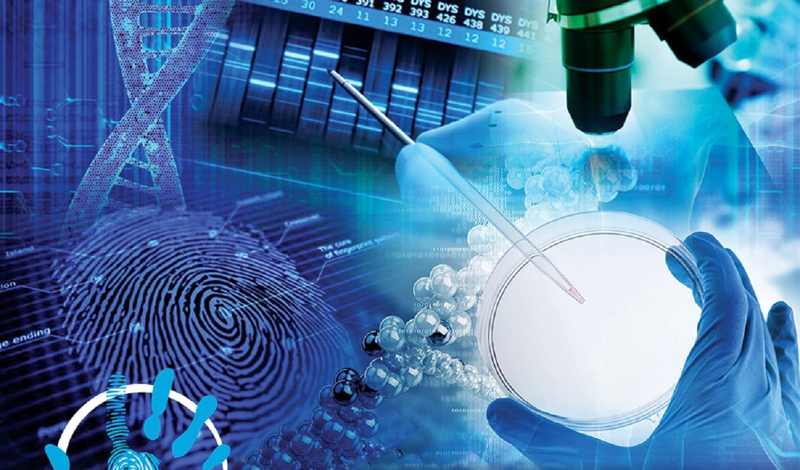
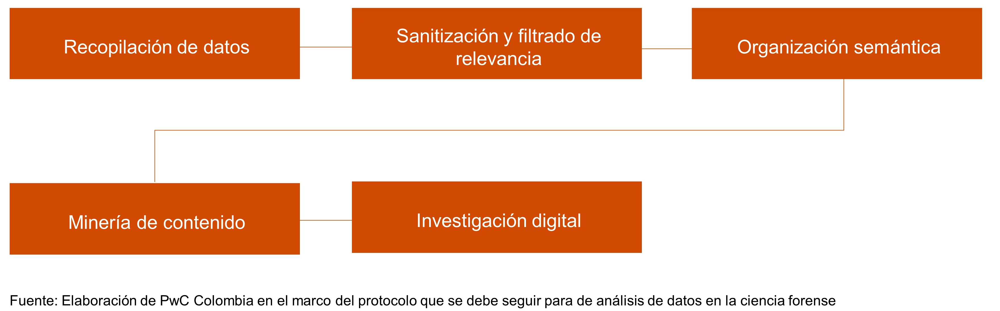

<br/><br/>

```{r setup, include=FALSE}
knitr::opts_chunk$set(echo = TRUE, comment = NA)

# paleta de colores

c1 = "#395A7F"
c2 = "#6E9FC1"
c3 = "#A3CAE9"
c4 = "#EEF4ED"
c5 = "#ACACAC"
c6 = "#F98125"
C7 = "#FB9B50"
```


<br/><br/>

# **Mineria de datos y aprendizaje automático** 
# **En la Ciencia Forense**


```{r, echo=FALSE, out.width="70%", fig.align = "center"}

```

<br/>

La ciencia de datos en el análisis forense surge a partir de  la necesidad de resolver problemas forenses en una era marcada por la digitalización. 

Uno de los desafíos, quizás, el más importante está dado por el uso masivo de las redes sociales, lo cual ha facilitado la generación de grandes cantidades de datos.  Esto, ha llevado a la necesidad del análisis eficiente de la información. Como lo deciamos en le sesión anterior, esto con la aparición progresiva de nuevas tecnologías (Open AI) plantea desafíos y también oportunidades a largo plazo para el análisis forense: se trata de poder identificar dentro de los grandes volúmenes de información, cuáles son reales y cuales parecen reales, pero son creados artificialmente a partir de tecnología inteligente. 

<br/>

Para dar solución a estos retos, se hace necesario el uso de tecnología de Inteligencia Artificial (IA), para garantizar el análisis masivo de datos y a la vez, asegurar la confianza y la eliminación de sesgos en el análisis.


<br/>

# **EJEMPLOS FAMOSOS**

<br/>

## **La invasión al Capitolio en los Estados Unidos** (enero de 2021)

<br/>

Los investigadores hicieron uso de algoritmos de reconocimiento facial para identificar a los posibles sospechosos, asociando los videos de las cámaras de seguridad con fotos disponibles en Internet. El uso  de esta tecnología apoyó a los investigadores en la identificación de los sospechosos, pero en una segunda etapa, mediante un análisis más profundo de los datos, los investigadores lograron responder a diferentes preguntas acerca del suceso. 

<br/>

Por ejemplo: ¿Cómo se organizaron los manifestantes? ¿Qué tipo de armas portaban? ¿Qué noticias falsas se compartieron sobre el evento?, entre otros.

Anteriormente, las únicas pistas en un análisis forense, estaban relacionadas con huellas dactilares, pisadas, fluidos, etc. 
Actualmente, gracias al uso de nuevas tecnologías, se pueden usar 

<br/>

*  fotografías
*  clips de audio o video
*  conversaciones instantáneas
*  publicaciones en redes sociales
*  transacciones bancarias 
*  historial de ubicación (GPS) 

en conclusión, todo tipo de datos  que puedan ser procesados y analizados. 

<br/>

Estas nuevas fuentes de información propician la transformación en varios campos de la ciencia forense: ya no se trata de un proceso lineal de recuperación de evidencias, sino un proceso integrado de organización de la información que requiere que sus expertos empleen un enfoque multidisciplinario para extraer inteligencia a partir de cantidades masivas de datos.


<br/><br/>

### **Protocolo**

<br/>

```{r, echo=FALSE, out.width="80%", fig.align = "center"}

```


<br/><br/>

### **El bombardeo en la Maratón de Boston** (2013)

<br/>

Si se da un evento a gran escala, es decir, por ejemplo, cuando la atención mundial se centra en el acomntecimiento, la cantidad de datos que se comparten es asombrosa. 

Un ejemplo es el bombardeo en la Maratón de Boston cuando dos bombas explotaron en la línea de meta en 2013, Twitter (en ese momento) se inundó con más de 700.000 menciones relacionadas con el ataque en menos de dos horas, incluidas imágenes y videos capturados en el lugar del suceso.

<br/><br/>

# **En general... **

Disponer de grandes volúmenes de datos representa una rica fuente de información, su análisis es fundamental pues apoya a los expertos en la comprensión y verificación de los hechos en el mundo físico. 

<br/>

El rápido análisis de dichos contenidos, facilitado por tecnologías inteligentes, posibilita la estructuración de  secuencias de los hechos, estableciendo conexiones entre las diferentes fuentes de datos y proporcionando simulaciones de escenarios reales durante y posteriores al evento. Esta recreación de panoramas reales, basados en información del mundo digital, es posible gracias al uso de técnicas de IA, cuya capacidad en el procesamiento de grandes cantidades de datos supera por mucho las capacidades humanas, especialmente cuando se necesitan en periodos de tiempo muy cortos.

<br/>

Además del análisis de imágenes, videos y otro tipo de material multimedia, la visualización tiene el potencial de complementar el análisis individual de los datos relacionados con un evento y se consolida como fuente de información clave para el campo de la ciencia forense, aunque ha sido poco explorado por la comunidad CF.

<br/>

Por otro lado, los avances de la última década en el campo del aprendizaje profundo (Deep Learning) han impulsado el desarrollo de potentes modelos estadísticos, generalmente basados en redes neuronales artificiales. Sin embargo, a medida que aumenta la complejidad de estos modelos, debido a la disponibilidad de datos, a las mejoras en el hardware y a los avances en las técnicas usadas, también se ha hecho más difícil su interpretación para la toma de decisiones.

<br/>

La comunidad científica ha explorado con éxito técnicas de aprendizaje automático, visión artificial y la programación neurolingüística, en prácticamente todas las etapas del proceso de análisis. Debido a la capacidad que tienen los métodos para reconocer y rastrear relaciones entre datos, su uso complementa los esfuerzos de los expertos, independientemente de si el evento ocurrió en el mundo físico, virtual, o en ambos. Los métodos modernos de IA se han convertido en herramientas imprescindibles para los expertos forenses

<br/>

A pesar de ser herramientas valiosas en el proceso forense, el uso de estas técnicas también trae consigo desafíos que deben debatirse para garantizar que su aplicación sea viable en casos reales, dado que a pesar de ser poderosos, los modelos complejos existentes se parecen a "cajas negras" que no se pueden descifrar fácilmente. Determinar la capacidad de interpretación y la transparencia del flujo de la información en estos modelos, para la toma de decisiones es esencial para avalar su uso. Además, es necesario mitigar los sesgos que muchas veces, se generan en estos modelos de análisis durante el entrenamiento, para que no se tengan en cuenta en la toma de decisiones.

<br/><br/>

# **Fuentes adicionales**

<br/>

### **Skopein:** Origen Argentina

Revista digital y su nombre, de raíz griega, significa «observar», hace referencia directa a una disciplina desarrollada en la Argentina, la Scopometría, siendo uno de los más grandes aportes de este país a la Criminalística, tratándose del conjunto de procedimientos y métodos que tienen por fin resolver las interrogantes periciales. Cuenta con convocatoria permanente de artículos y además, el equipo de Skopein se encarga de organizar las Jornadas Argentinas de Ciencias Forenses Aplicadas, evento nacional que reúne prestigiosos profesionales relacionados con las ciencias criminalísticas y forenses, dirigido tanto a estudiantes como a profesionales de diversas áreas.


<br/><br/>

### **Ciencia del crimen:** Origen Argentina

Revista que publica casos reales con el aporte que cada profesional hizo desde su perspectiva y especialidad, compartiendo la visión y la experiencia de un grupo de excelentes expertos en análisis e investigación del crimen.

<br/><br/>

### **La Consultora:** Origen Argentina

Equipo de profesionales dedicado a la criminalística y criminología.

<br/><br/>

### **Expresión forense:** Origen México

La misión de Expresión Forense es divulgar el desarrollo de la ciencia y ayudar a los lectores a adentrarse en la complejidad del conocimiento científico.

<br/><br/>

###  **Revista de Ciencias Forenses de Honduras:**  Origen Honduras

La Revista de Ciencias Forenses de Honduras (RCFH) es el órgano de difusión técnico-científico de la Dirección de Medicina Forense del Sector Seguridad y Justicia. Adscrita al Ministerio Público de Honduras, posee un enfoque multidisciplinario e intersectorial.

<br/><br/>

### **Colombia Forense:**  Origen Colombia

Colombia Forense es una revista científica arbitrada, especializada en medicina legal y ciencias forenses, dirigida a investigadores hispanoamericanos.
