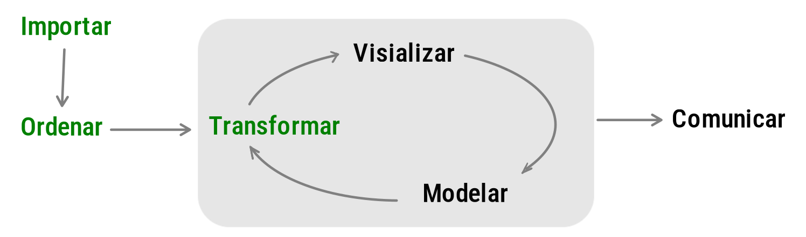
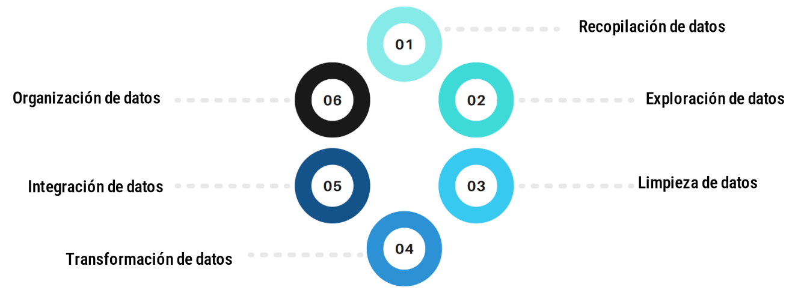
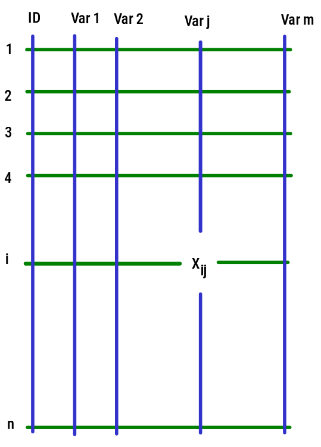

<br/><br/>

```{r setup, include=FALSE}
knitr::opts_chunk$set(echo = TRUE, comment = NA)

# paleta de colores

c1 ="#3B566E"  # azul oscuro- color primario 
c2 ="#6487A5"  # azul claro- color secundario
c3 ="#2ED199"  # verdeclaro - color terciario
c4 ="#F2F2F2"  # gris muy claro - color texto
c5 ="#8DA9C4"  # azul claro 
c6= "#04BA80"  # verde claro
c7= "#0E9183"  # verde oscuro

```


<br/><br/>


# <span style="color:#0E9183">**Preparación de Datos en MD y CD**</span>

<br/><br/>

El proceso de preparación de datos esta inmerso dentro del proceso de ciencia de datos, constituyendo sus tres primeras etapas


```{r, echo=FALSE, out.width="80%", fig.align = "center"}

```

<center>
<sub>
Tomado de : [Ciencia de Datos para Gente Sociable](https://bitsandbricks.github.io/ciencia_de_datos_gente_sociable/qu%C3%A9-es-la-ciencia-de-datos.html)
</sub>
</center>

<br/><br/>


#  <span style="color:#0E9183">**Introducción**</span>

<br/>

La preparación de datos es una fase esencial en el ciclo de vida de la minería de datos y la ciencia de datos. Aunque a menudo se subestima, la calidad de los resultados de análisis y modelos depende en gran medida de la calidad de los datos utilizados. 

<br/><br/>


#  <span style="color:#0E9183">**Importancia de la Preparación de Datos**</span> 

Dentro de las principales razones por las que debe tener en cuenta la preparación de los datos en un proyecto de ciencia de datos estan:


<br/><br/>

## <span style="color:#0E9183">**Calidad de los Datos**</span> 

La calidad de los datos es muy importante para obtener resultados precisos y confiables. La preparación de datos aborda problemas como datos faltantes (NA), duplicados, errores y valores atípicos. Si estos problemas son tratados adecuadamente se  mejora la calidad general de los datos.

<br/><br/>

## <span style="color:#0E9183">**Consistencia**</span> 

La consistencia en la estructura y formato de los datos facilita su interpretación y análisis. La preparación de datos garantiza que los datos sean coherentes y cumplan con estándares definidos. La estructura se puede representar como una matriz formada por filas que representan los registros de un objeto o persona y por columnas que reprsentan las caracteristicas o variables.  

<br/><br/>

## <span style="color:#0E9183">**Mejora del Rendimiento del Modelo**</span> 

Los modelos de minería de datos y aprendizaje automático dependen de datos de alta calidad. Una preparación adecuada puede mejorar el rendimiento del modelo al proporcionar entradas más relevantes y precisas. En este caso los modelos requieren de un tipo de variables (categóricas, numéricas, dicótomas,..) que deben estar definidos en la base de datos a emplear 


<br/><br/><br/>

#  <span style="color:#0E9183">**Etapas de la Preparación de Datos**</span> 

<br/><br/>


```{r, echo=FALSE, out.width="100%", fig.align = "center"}

```

<br/><br/>


## <span style="color:#0E9183">**Recopilación de Datos**</span> 

En esta fase, se adquieren los datos desde diversas fuentes. Esto puede incluir bases de datos, archivos CSV, API web, entre otros. Es fundamental comprender la naturaleza de los datos y los requisitos específicos del problema.

<br/>

### **Importar datos**

* Captura directa de fuentes primarias en una hoja electrónica compartida
* Disponible en datos abiertos en formatos csv, xlsx - informacioón secundaria
* Recoleccción de información mediante técnicas automáicas - webscraping 
* De manea automática, mediante el empleo de tokes 
* ....

<br/><br/>

## <span style="color:#0E9183">**Exploración de Datos**</span> 

Antes de la limpieza, se realiza una exploración inicial para comprender la distribución de los datos, identificar patrones y visualizar posibles relaciones. Esta fase ayuda a diseñar estrategias efectivas de preparación.

<br/><br/>

## <span style="color:#0E9183">**Limpieza de Datos**</span> 

La limpieza aborda problemas como valores nulos, duplicados y errores. Se aplican técnicas como imputación de datos faltantes, eliminación de duplicados y corrección de errores para asegurar la coherencia de los datos.

<br/><br/>

## <span style="color:#0E9183">**Transformación de Datos**</span> 

La transformación incluye la conversión de datos en un formato adecuado para el análisis. Esto puede involucrar normalización, codificación de variables categóricas y creación de nuevas características derivadas.

<br/><br/>

## <span style="color:#0E9183">**Integración de Datos**</span> 

Cuando se utilizan múltiples fuentes de datos, es crucial integrarlos de manera coherente. Esto implica combinar conjuntos de datos, manejar redundancias y asegurar la consistencia entre ellos.


<br/><br/>

## <span style="color:#0E9183">**Organización de Datos**</span> 

La organización implica estructurar los datos de manera que sean accesibles y eficientes para el análisis posterior. Se crean conjuntos de datos de entrenamiento y prueba, y se establecen divisiones adecuadas.


<br/><br/>

# <span style="color:#0E9183">**Herramientas y Técnicas**</span> 

<br/><br/>

## <span style="color:#0E9183">**1. Software de Preparación de Datos**</span> 


Herramientas como Python y RStudio-R, simplifican las tareas de preparación de datos mediante múmltiples paquetes y  funciones.

<br/><br/>

## <span style="color:#0E9183">**2. Técnicas de Imputación**</span> 

La imputación de datos faltantes puede realizarse mediante técnicas como remplazar los datos faltantes por cero,  

la media, la mediana o algoritmos más avanzados como k-vecinos más cercanos (KNN).

<br/><br/>

## <span style="color:#0E9183">**3. Normalización y Estandarización**</span> 

Estas técnicas son esenciales para asegurar que las variables tengan la misma escala, evitando que algunas variables dominen sobre otras en el análisis.

<br/><br/><br/><br/>


# <span style="color:#0E9183">**Conceptos adicionales**</span> 

<br/>

# <span style="color:#0E9183">**Base de datos**</span> 

**base de datos** puede referirse a un conjunto de datos organizado en un arreglo de filas y columnas, comúnmente conocido como un "conjunto de datos" o "tabla de datos". Este arreglo estructurado facilita la manipulación y análisis de datos. De forma general una base de datos está formada por `n` filas y `m` columnas (dimensión `n x m`).


```{r, echo=FALSE, out.width="30%", fig.align = "center"}

```


<br/><br/>

## <span style="color:#0E9183">**Variable**</span> 

Cada columna en la base de datos representa una variable. Estas variables pueden ser características, medidas o atributos relacionados con el fenómeno que se está estudiando y estan representadas por las líneas azules ($\text{Var}_1$, $\text{Var}_2$,$\dots \dots$, $\text{Var}_j$,$\dots$, $\text{Var}_m$)

<br/><br/>

## <span style="color:#0E9183">**Observaciones**</span> 

Cada fila en la base de datos corresponde a una observación o unidad individual. Dependiendo del contexto, una observación puede representar un individuo, una ciudad, un evento, una medición, entre otras. Por lo general se emplea una variables (`ID`) que permite identificar la unidad que origina la información que va desde $1, 2, 3, \dots \dots    n$

<br/><br/>

## <span style="color:#0E9183">**Datos**</span> 

Es una unidad básica de información que se recopila, registra o representa. Los datos son observaciones o medidas que pueden ser cuantitativas o cualitativas y que se utilizan para realizar análisis, interpretaciones y toma de decisiones. Un dato en particular se representa por $x_{ij}$, lo cual indica que pertenece a la unidad $i$ y a la variable $\text{Var}_j$

Hay dos tipos principales de datos:

<br/>

**Datos Cuantitativos**: Estos datos representan cantidades numéricas y se expresan en términos de números.  

<br/>

**Datos Cualitativos**: Estos datos representan características no numéricas y se expresan en términos de categorías. 

<br/><br/>

## <span style="color:#0E9183">**Datos faltantes**</span> 

La base de datos puede contener valores faltantes (`NA`), los cuales requeren de tratamientos como su exclusión o de técnicas como la imputación para su manejo durante el análisis de datos.

<br/><br/>

## <span style="color:#0E9183">**Valores atípicos**</span> 

Son observaciones inusuales o extremas en un conjunto de datos que se desvían significativamente del patrón general de la muestra. Estos valores atípicos o tambien llamados `outliers`, pueden tener un impacto importante en el análisis de los datos, ya que pueden distorsionar los resultados y afectar la interpretación de los datos. 


<br/><br/><br/><br/>

 <!-- https://www.kaggle.com/datasets/beelzabi/crimen-mx?resource=download -->
 
 <!-- https://data.world/datasets/crime -->