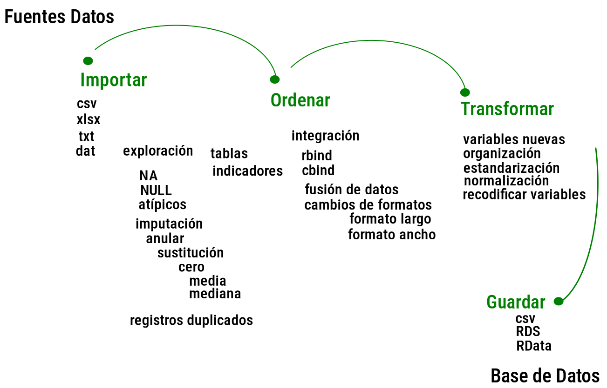

<br/><br/>

```{r setup, include=FALSE}
knitr::opts_chunk$set(echo = TRUE, comment = NA)

# paleta de colores
c1 ="#3B566E"  # azul oscuro- color primario 
c2 ="#6487A5"  # azul claro- color secundario
c3 ="#2ED199"  # verdeclaro - color terciario
c4 ="#F2F2F2"  # gris muy claro - color texto
c5 ="#8DA9C4"  # azul claro 
c6= "#04BA80"  # verde claro
c7= "#0E9183"  # verde oscuro
```


```{r, echo=FALSE, out.width="100%", fig.align = "center"}

```

</br></br></br>

La preparación de los datos está precedida de una serie de etapas como son :

</br>

* Definición del problema 
* Definición de los objetivos 
* Definición de las variables de interés
* Definición del tipo de estudio 

</br>

Es decir que al tener claridad de estos pasos previos y su relación se procederá a seleccionar las fuentes de información que contienen lo necesario para nuestro trabajo 

<br/></br>

<div class="content-box-green">
### **NOTA**

Es posible que estas etapas previas pasen desapercibidas para los usuarios de información, sobre todo cuando se utilizan fuentes secundarias que han sido recogidas con otros propósitos.

</div>

<br/><br/>


## <span style="color:#0E9183">**IMPORTAR**</span>

</br>

Definida las fuentes de los datos se procede a **IMPORTAR** la información desde diferentes tipos de fuentes y formatos, de manera estructurada y no estructurada . Nos enfocaremos en las fuentes estructuradas en bases de datos con csv, xlsx, txt, dat. 

</br>

Para que estos datos sean procesados y convertidos en información útil, requieren ser **TRANSFORMADOS** y **ORDENADOS** de tal forma que permitan la construcción de tablas, indicadores y gráficos.


<br/></br>

## <span style="color:#0E9183">**EXPLORACIÓN**</span>

</br>

Despues de importar los datos se procede a realizar una **EXPLORACIÓN** de la información contenida y su estructura.  Esta labor se realiza mediante la visualización de sus principales características y la construcción de tablas y resumen de indicadores.

</br>

Dentro de este proceso de examina:

</br>

* En caso de ser una hoja electrónica, se determina el rango que ocupa y su conformación

</br>

* Debe de tener una estructura donde las filas correspondan a información de los objetos observados o **unidades de observación** - registros. Las columnas deben corresponder a las caracteristicas observadas para cada objeto o unidad de observación que llamaremos **variables**.

</br>

* Se sugiere que los nombres de las variables deben ser cortos, no deben contener caracteres especiales no espacios. Aunque podrían ser x1,x2,x3,....xm facilitando su escritura, tambien es bueno tener nombre con los se pueda reconocer rápidamente la variable. Por ejemplo:  

</br>

  * En lugar de "Código de Departamento", "coddep"
  * En lugar de "Periodo del Indicador", "periodo"                  
  * En lugar de "Rangos de edad o edades simples", "edadR"
  * "Resultado (Tasa)" , "casos"
  * "Hombre Numerador (casos)", "casoshom"

</br>

* Si la base contiene en su primera fila el nombre de las variables. En caso contrario, será necesario borrar las filas adicionales o indicar el rango en el momento de importar la base

</br>

* Revisar si existen datos faltantes (NA), con el fin de evaluar su impacto sobre los análisis y tomar la determinación de excluirlos - borrarlos - o mantenerlos e imputarlos. En el caso de decidir imputarlos, se debe determinar el tipo de imputación a realizar, dado que el valor pueda estar relacionado con: 
* podría tomar el valor de cero, debido a que la persona interpretó de esta forma
* no respuesta
* no digitada

</br>

* Al realizar la IMPUTACIÓN**  se puede reemplazar por la media de la variable o la mediana, bajo la hipótesis que este cambio no afectará el análisis. También se pueden emplear métodos avanzados que permitan reemplazar el valor por el de una unidad con características similares.

</br>

* En caso de presentarse registros duplicados se pueden unificar. En caso de variables cualitativas conservando su valor, en otros por su valor máximo, la suma o la media según el caso.

</br></br>

## <span style="color:#0E9183">**ORDENAR**</span>

</br>

De acuerdo con con los objetivos, el estudio a realizar se construye la estructura de la base de datos. Puede ser necesario: 

</br>

* Integrar dos bases de datos, adicionando variables o adicionando registros

</br>

* Cambiar el formato de los datos :
  * Formato largo a formato ancho
  * Formato ancho a formato largo

</br>

* Cambiar el orden de las variables

</br>

* Seleccionar un grupo de variables, conformando una base más pequeña

</br>

* Seleccionar registros y conformar una base de acuerdo con unas condiciones

</br>

* Realizar transformaciones de variables

</br>

* Estandarizar

</br>

* Normalizar

</br>

* Recodificar variables

</br>

* Construir nuevas variables

<br/></br>

## <span style="color:#0E9183">**GUARADAR**</span>

</br>

Finalmente se guarda la base de datos depurada para ser empleada en los análisis exploratorios y posteriormente en la modelación e inferencia estadística


<br/></br><br/></br>

**>>    A PRACTICAR LOS VISTO  !!**


