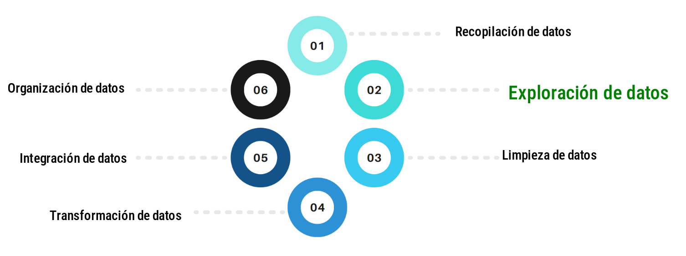

<a id="inicio"></a>

<br/><br/>

```{r setup, include=FALSE}
knitr::opts_chunk$set(echo = TRUE, comment = NA)

# paleta de colores

c1 ="#3B566E"  # azul oscuro- color primario 
c2 ="#6487A5"  # azul claro- color secundario
c3 ="#2ED199"  # verdeclaro - color terciario
c4 ="#F2F2F2"  # gris muy claro - color texto
c5 ="#8DA9C4"  # azul claro 
c6= "#04BA80"  # verde claro
c7= "#0E9183"  # verde oscuro
```


<br/><br/>

```{r, echo=FALSE, out.width="100%", fig.align = "center"}

```

<br/><br/><br/>


El análisis exploratorio de datos (**EDA**, por sus siglas en inglés) es una etapa imporante en el proceso de análisis estadístico que tiene como objetivo **COMPRENDER** y **RESUMIR** las principales características  de una base de datos. El EDA se centra en explorar los datos de manera visual y descriptiva para identificar **patrones**, **tendencias**, **relaciones** y posibles **anomalías** que puedan ayudar a formular hipótesis o guiar análisis posteriores más detallados.

Los principales elementos del análisis exploratorio de datos incluyen:


* Resumen Estadístico
* Viaualización de datos
* Análisis de correlación
* Exploración datos faltantes
* Detección de valores atípicos
* Transformación de variables
* Análisis de tendencias y patrones temporales

<br/><br/>

## <span style="color:#0E9183">**Resumen estadístico**:</span> 

Medidas resumidas de tendencia central, como la **media**, la **mediana** y la **moda**. Dispersión,  como la **desviación estándar**,  **rango**, **varianza, coficiente de variación**,  **rango intercuartílico**. Forma vomo el **sesgo** y la **curtosos** Por último los indicadores de posición como **percentiles**, **deciles**, **cuartiles**. Y de esta forma tener una idea general de la distribución de los datos.

<br/><br/>

## <span style="color:#0E9183">**Visualización de datos**:</span> 

Utilizando gráficos y diagramas, dependiendo del tipo de variables y de sus escalas de medición:


* variables **cualitaticas** en escala **nominal**:

  * diagramas circules o de torta
  
* variables **cualitativas** en escala **ordinal**:

  * diagrama de barras
  * diagramas likert
  * diagramas de radar
  
* variables **cuantitativas** en escara de **intervalo** o de **razón** :

  * histograma - hist
  * diagrama de cajas - boxplot
  * diagrama de dispersión - scaterplot
  * diagrama de densidad
  

<br/><br/>

## <span style="color:#0E9183">**Análisis de correlación**:</span> 

Evaluar la relación entre variables mediante el cálculo de **coeficientes de correlación**, como el coeficiente de correlación de **Pearson** o de **Spearman**, para determinar si existe una asociación lineal o monotónica entre pares de variables.


<br/><br/>

## <span style="color:#0E9183">**Exploración de datos faltantes**:</span> 

Identificar y manejar **valores faltantes** en el conjunto de datos, comprendiendo la naturaleza y el patrón de los valores ausentes, y seleccionar la mejor estrategia para manejarlos, ya sea **eliminándolos**, **imputándolos** o utilizando técnicas más avanzadas.

<br/><br/>

## <span style="color:#0E9183">**Detección de valores atípicos**:</span> 

Identificar observaciones que se desvían significativamente del patrón general de los datos, lo cual podría indicar errores en la recopilación de datos, mediciones inusuales o eventos extraordinarios. Uno de los métodos empleados para su detecciós es el gráfico de cajas.


<br/><br/>

## <span style="color:#0E9183">**Transformación de variables**:</span> 

Aplicar transformaciones a las variables si es necesario, como la transformación **logarítmica**, para manejar sesgos, mejorar la simetría de la distribución o estabilizar la varianza.


<br/><br/>

## <span style="color:#0E9183">**Análisis de tendencias y patrones temporales**:</span> 

Para conjuntos de datos temporales, explorar patrones **estacionales**, de **tendencia** o **ciclos** mediante técnicas como la descomposición de series temporales.


Algunas de las cuales ya se han tradado en las sesiones anteriores. 

Empezaremos por los indicadores y posteriormente trataremos lo relacionado con los gráficos

<!-- [Volver al inicio](#inicio) -->
