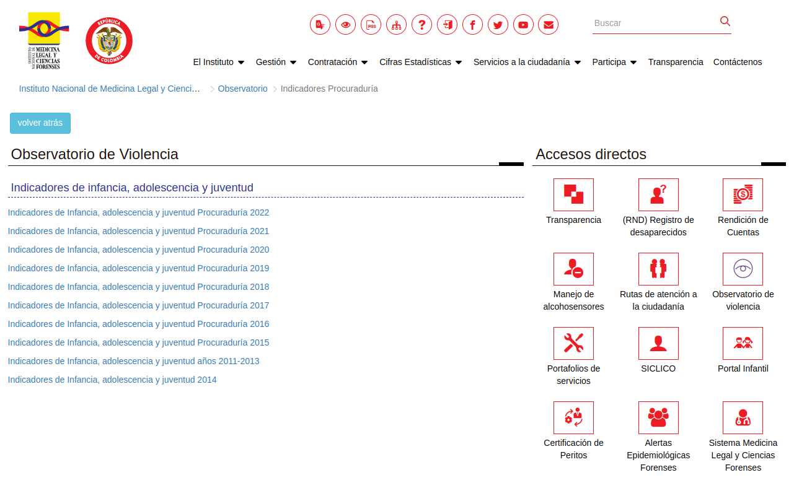
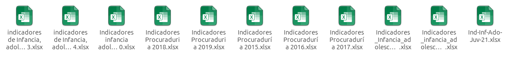
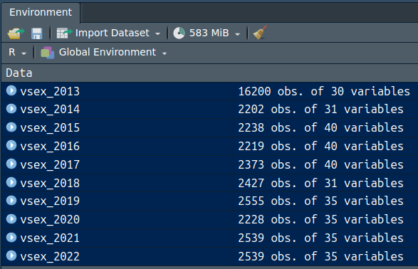
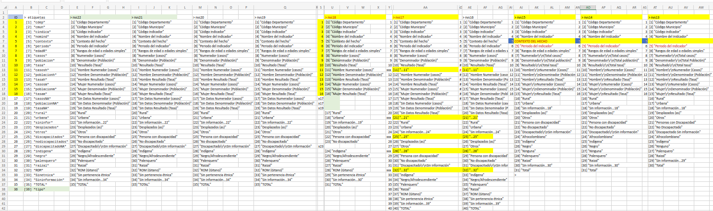

<br/><br/>

```{r setup, include=FALSE}
knitr::opts_chunk$set(echo = TRUE, comment = NA)

# paleta de colores

c1 ="#3B566E"  # azul oscuro- color primario 
c2 ="#6487A5"  # azul claro- color secundario
c3 ="#2ED199"  # verdeclaro - color terciario
c4 ="#F2F2F2"  # gris muy claro - color texto
c5 ="#8DA9C4"  # azul claro 
c6= "#04BA80"  # verde claro
c7= "#0E9183"  # verde oscuro
```


<br/><br/>

En el objetivo de poner en practica lo desarrollado en el módulo, se presenta la siguiente guía que puede ser ejecutada en RStudio Cloud o en RStudio instaldo localmente.

El material utilizado durante el proceso tambien estará disponible en el repositorio de github : **https://github.com/dgonxalex80/seminarioML.git**


Se recomienda clonar el repositorio en RStudio (como se realzó en las sesiones - ver videos)

<br/><br/>

## **Paso 1**
### **DESCARGAR LA DATA DESDE EL OBSERVATORIO**

Se descargan las bases de datos desde el observatorio de violencia


```{r, echo=FALSE, out.width="100%", fig.align = "center"}

```

Y posteriormente se alojan todos libros de excel en el directorio `data`

<br/><br/>

```{r, echo=FALSE, out.width="100%", fig.align = "center"}

```

<br/><br/>

## **Paso 2**
###  **IMPORTAR LA INFORMACIÓN DE LOS LIBORS DE EXCEL**

Para imprtar las base se realiza un visualizaciṕon de las hojas del libro y la hoja electrónica, con el fin de tener claridad sobre el rango que ocupa y así asignar los parámetros de la función de R a emplear


```{r, warning=FALSE, message=FALSE}
# 1. IMPORTAR LAS BASES DE DATOS

library(readxl) # paquete para leer libros de excel
vsex_2022 <- read_excel("data/Indicadores_infancia_adolescencia_juventud_Procuraduria_2022.xlsx",  # nombre del archivo
                                 sheet = "Ind. Violencia Sexual",  # nombre de la hoja corespondiente
                                 range = "B9:AJ2548")   # rango que ocula la base

vsex_2021 <-read_excel("data/Indicadores_Infancia_adolescencia_juventud_2021.xlsx", 
                                sheet = "Ind. Violencia Sexual", 
                                range = "B9:AJ2548")

vsex_2020 <- read_excel("data/Indicadores infancia adolescencia y juventud Procuraduria 2020.xlsx", 
                                 sheet = "Ind. Violencia Sexual",
                                 range = "B9:AJ2237")


vsex_2019 <- read_excel("data/Indicadores Procuraduria 2019.xlsx",
                                 sheet = "Ind. Violencia Sexual", 
                                 range= "B9:AJ2564")

vsex_2018 <- read_excel("data/Indicadores Procuraduria 2018.xlsx",
                                 sheet = "Ind. Violencia Sexual", 
                                 range= "A8:AE2435")

vsex_2017 <- read_excel("data/Indicadores Procuraduría 2017.xlsx", 
                                 sheet = "Ind. Violencia Sexual", 
                                 range = "B9:AO2382")

vsex_2017 <- read_excel("data/Indicadores Procuraduría 2017.xlsx", 
                                 sheet = "Ind. Violencia Sexual", 
                                 range = "B9:AO2382")

vsex_2016 <- read_excel("data/Indicadores Procuraduría 2016.xlsx", 
                                 sheet = "Ind. Violencia Sexual", 
                                 range = "B9:AO2228")

vsex_2015 <- read_excel("data/Indicadores Procuraduría 2015.xlsx", 
                                 sheet = "Ind. Violencia Sexual", 
                                 range = "B9:AO2247")


vsex_2014 <- read_excel("data/indicadores de Infancia, adolescencia y juventud 2014.xlsx", 
                                 sheet = "BATERIA VIOLENCIA SEXUAL 2014", 
                                 range = "A1:AE2203")

vsex_2013 <- read_excel("data/indicadores de Infancia, adolescencia y juventud2011-2013.xlsx", 
                                 sheet = "BATERIA IND. VIOLENCIA SEXUAL", 
                                 range = "A1:AD16201")

```


```{r, echo=FALSE, out.width="50%", fig.align = "center"}

```

El resultado indica que se han cargado a RStudio 10 bases de datos (vsex2013 que contiene información de los años 2011, 2012 y 2013) .... vsex_2022

<br/><br/>

## **Paso 3**
### **INSPECCIÓN DE LAS BASES DE DATOS IMPORTATAS**

Con el fin de estudiar la estructura de las bases se emplea la función de R str

```{r}
str(vsex_2022)
```

Este procedimiento permite visualizar:

* nombre de las variables
* tipo de variable
* dimensión 
* primeros valores 


<br/><br/>

## **Paso 4**
### **UNIÓN DE LAS BASES**


Con este propósito se realizón una revisión de los nombres de las variables para las 10 bases de datos 


```{r, echo=FALSE, out.width="100%", fig.align = "center"}

```

Se observa que las bases conciden en 16 variables, requiriendo realizar ajustes - adicionar o eliminar columnas - . Procedimiento que se realiza a continuación

```{r, warning=FALSE, message=FALSE}
# # 02- SELECCION DE VARIABLES 

vsex22 <- vsex_2022[, 1:16]
vsex21 <- vsex_2021[, 1:16]
vsex20 <- vsex_2020[, 1:16]
vsex19 <- vsex_2019[, 1:16]
vsex18 <- vsex_2018[, 1:16]
#------------------------------------
# Quitar variable - espacio en blanco
vsex17 <- vsex_2017[, 1:17]
vsex16 <- vsex_2016[, 1:17]

library(dplyr) # -------------------
vsex16 <- vsex16 %>%
            select(-11)

vsex17 <- vsex17 %>%
            select(-11)

#------------------------------------
# Adicionar variable faltante como NA 
vsex15 <- vsex_2015[, 1:17]
vsex14 <- vsex_2014[, 1:15]
vsex13 <- vsex_2013[, 1:15]

vsex15 <- vsex15 %>%
            select(-11)

# Crear una nueva variable llena de NAs 2014
'Contexto del hecho' <- rep(NA, nrow(vsex14))
vsex14 <-cbind(vsex14[, 1:4], 'Contexto del hecho', vsex14[, 5:15])

vsex14 <- vsex14 %>%
  mutate_at(5, ~ NA)


# Crear una nueva variable llena de NAs 2013 - 2011
'Contexto del hecho' <- rep(NA, nrow(vsex13))
vsex13 <-cbind(vsex13[, 1:4], 'Contexto del hecho', vsex13[, 5:15])

names(vsex22)

```


<br/><br/>


## **Paso 5**
### **CAMBIO DEL NOMBRE DE LAS VARIABLES**

Con el fin de acortar el nombre de las variables por unos que no contengan espacios en blanco, facilitando el manejo posterior se promomen los siguientes nombres


```{r}

names(vsex13) = c("cdep","cmun","cindica", "nomind","contexto", "periodo",
                 "edadR", "casos", "poblacion","tasa", "casosh", "poblacionh", 
                 "tasah", "casosm", "poblacionm", "tasam") 

names(vsex14) = c("cdep","cmun","cindica", "nomind","contexto", "periodo",
                  "edadR", "casos", "poblacion","tasa", "casosh", "poblacionh", 
                  "tasah", "casosm", "poblacionm", "tasam") 

names(vsex15) = c("cdep","cmun","cindica", "nomind","contexto", "periodo",
                  "edadR", "casos", "poblacion","tasa", "casosh", "poblacionh", 
                  "tasah", "casosm", "poblacionm", "tasam") 

names(vsex16) = c("cdep","cmun","cindica", "nomind","contexto", "periodo",
                  "edadR", "casos", "poblacion","tasa", "casosh", "poblacionh", 
                  "tasah", "casosm", "poblacionm", "tasam") 

names(vsex17) = c("cdep","cmun","cindica", "nomind","contexto", "periodo",
                  "edadR", "casos", "poblacion","tasa", "casosh", "poblacionh", 
                  "tasah", "casosm", "poblacionm", "tasam") 

names(vsex18) = c("cdep","cmun","cindica", "nomind","contexto", "periodo",
                  "edadR", "casos", "poblacion","tasa", "casosh", "poblacionh", 
                  "tasah", "casosm", "poblacionm", "tasam") 

names(vsex19) = c("cdep","cmun","cindica", "nomind","contexto", "periodo",
                  "edadR", "casos", "poblacion","tasa", "casosh", "poblacionh", 
                  "tasah", "casosm", "poblacionm", "tasam") 

names(vsex20) = c("cdep","cmun","cindica", "nomind","contexto", "periodo",
                  "edadR", "casos", "poblacion","tasa", "casosh", "poblacionh", 
                  "tasah", "casosm", "poblacionm", "tasam") 

names(vsex21) = c("cdep","cmun","cindica", "nomind","contexto", "periodo",
                  "edadR", "casos", "poblacion","tasa", "casosh", "poblacionh", 
                  "tasah", "casosm", "poblacionm", "tasam") 

names(vsex22) = c("cdep","cmun","cindica", "nomind","contexto", "periodo",
                  "edadR", "casos", "poblacion","tasa", "casosh", "poblacionh", 
                  "tasah", "casosm", "poblacionm", "tasam") 

names(vsex22)

```


## **Paso 6**
### **UNION DE LAS BASES DE DATOS**

En este paso se emplea la funcion rbind() . Esta función requiere que las bases a unir tengan el mismo número de variables y que sus nombre sean iguales.

```{r}

vsex = rbind(vsex13,
                      vsex14,
                      vsex15,
                      vsex16,
                      vsex17,
                      vsex18,
                      vsex19,
                      vsex20,
                      vsex21,
                      vsex22)

str(vsex)

table(vsex$periodo)

```

<br/><br/>

## **Paso 7**
### **AJUSTES DE VARIABLES**

Al revisar el tipo de las variables, se observó que la variables edadR presentava  la siguiente inconsistencia :

```{r}
table(vsex$edadR)
```

Con el fin de corregir el problema se convierte la variable de caracter a numérica con el fin de que conserve el orden en las tablas y en los gráficos 

```{r}
vsex$edadR[vsex$edadR == "Menores de 1 año"] = 1
vsex$edadR[vsex$edadR == "Menores de un año"] = 1
vsex$edadR[vsex$edadR == "(01 a 05)"] =2
vsex$edadR[vsex$edadR == "(06 a 11)"] =3
vsex$edadR[vsex$edadR == "(12 a 17)"] =4
vsex$edadR[vsex$edadR == "(18 a 28)"] =5

tedadR =table(vsex$edadR)
names(tedadR) = c("menos 1", "1-5", "6-11", "12-17", "18-28")
tedadR
barplot(tedadR)
```

## **Paso 8**
### **DETECCIÓN DE DATOS FALTANTES**

```{r}
library(dplyr)
faltantes <- colSums(is.na(vsex)) %>%
                  data.frame()
faltantes
```

Antes de pensar en eliminar la variables contexto, dado el gran número de datos faltantes (NA), se explora su distribución

```{r}
table(vsex$contexto, vsex$edadR)
```


```{r}
table(vsex$contexto, vsex$cindica)
```


```{r}
table(vsex$contexto, vsex$periodo)
```

Se puede ver claramente que la variables contexto está relacionada con la variable periodo y que se puede eliminar sin afectar el contenido de la información contenida en la base vsex

```{r}
vsex <- vsex %>%
            select(-5)
str(vsex)
```


```{r}
library(dplyr)
faltantes <- colSums(is.na(vsex)) %>%
                  data.frame()
faltantes
```


```{r}
vsex <- na.omit(vsex)

# install.packages("naniar")
library(naniar)
gg_miss_var(vsex) # grafico de datos faltantes

table(vsex$periodo)
```

<br/><br/>

## **Paso 9**
### **GUARDADO DE LA BASE DE DATOS**

Realizado los ajustes a la base de datos se procede a guardar la base de datos 

```{r}
write.csv(vsex, "bases/vsex.csv")
saveRDS(vsex, "bases/vsex.RDS")
```

<br/><br/>

## **Paso 10**
### **EXPLORACIÓN DE LOS DATOS**

Con el fin de contrastar el contenido de la base de datos con el conocimiento externo que poseen los usuarios de la información se realizan las siguientes tablas, resumenes y gráficas

Empezaremos con una tabla de departamento por periodo


```{r}
t1 <- table(vsex$cdep,vsex$periodo)
t1
```

```{r}
# heatmap(t1, col = c("white", "red"), symkey = FALSE)

```


