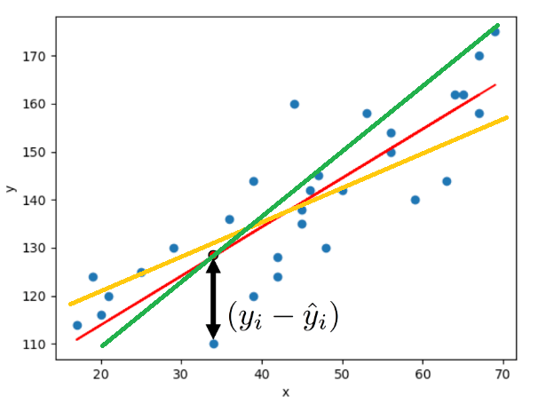

<br/><br/>

```{r setup, include=FALSE}
knitr::opts_chunk$set(echo = TRUE, comment = NA)

# paleta de colores

c1 ="#3B566E"  # azul oscuro- color primario 
c2 ="#6487A5"  # azul claro- color secundario
c3 ="#2ED199"  # verdeclaro - color terciario
c4 ="#F2F2F2"  # gris muy claro - color texto
c5 ="#8DA9C4"  # azul claro 
c6= "#04BA80"  # verde claro
c7= "#0E9183"  # verde oscuro
```


<br/><br/>

# <span style="color:#0E9183">**Correlación y Regresión Lineal**</span>


En el análisis de datos, la **correlación** y la **regresión lineal** son dos conceptos fundamentales para entender las relaciones lineales entre variables cuantitativas. En la gráfica, visualizamos ambos conceptos, los cuales están relacionados pero no son lo mismo, en esta unidad los definiremos.

```{r, fig.align='center'}
par(mfrow = c(1, 2))
set.seed(1)
x <- 1:100
y <- x + rnorm(100, mean = 0, sd = 15)

# Creamos el gráfico
plot(x, y, pch = 19, col = "lightblue", las=1)
plot(x, y, pch = 19, col = "lightblue", las=1) 
# Línea de regresión
abline(lm(y ~ x), col = "red", lwd = 3)

# Correlación de Pearson
text(paste("Cor:", round(cor(x, y), 2)), x = 25, y = 95)
```

<br/><br/>

## <span style="color:#0E9183">**Correlación**</span> 

La correlación estudia si existe asociación entre dos variables cuantitativas y establece cuál es la dirección y la magnitud de esa asociación.  Es importante para entender cómo estas variables están relacionadas entre sí. 

- **Asociación Lineal**: La correlación examina si hay una relación lineal entre las variables. Esto significa que a medida que una variable aumenta, la otra también aumenta (correlación positiva), o a medida que una variable disminuye, la otra disminuye (correlación negativa).

- **Magnitud de la Relación**: La correlación proporciona información sobre la fuerza de la relación entre las variables. Un coeficiente de correlación cercano a $\pm 1$ indica una relación fuerte, mientras que cerca de $0$ indica una relación débil.


<br/><br/>


### <span style="color:#0E9183">**Interpretación**</span> 

La correlación es una medida numérica que va desde -1 hasta 1.

- Un coeficiente de $1$ indica una correlación perfectamente positiva.
- Un coeficiente de $-1$ indica una correlación perfectamente negativa.
- Un coeficiente de $0$ indica que no hay correlación lineal.

<br/><br/>

```{r, fig.align='center'}

# Cargar la librería
library(ggplot2)

# Crear un conjunto de datos de ejemplo
set.seed(123)
datos <- data.frame(
  X = 1:100,                                   # Variable X: correlación positiva
  Y_positiva = 1:100 + rnorm(100, sd = 10),    # Variable Y con correlación positiva
  Y_negativa = 100:1 + rnorm(100, sd = 10),    # Variable Y con correlación negativa
  Y_sin_asociacion = rnorm(100, sd = 10)       # Variable Y sin asociación
)

# Gráfico de dispersión para correlación positiva
ggplot(datos, aes(x = X, y = Y_positiva)) +
  geom_point(color = "blue") +
  #geom_smooth(method = " ", se = FALSE) +
  labs(title = "Correlación Positiva",
       x = "Variable X",
       y = "Variable Y_positiva")

# Gráfico de dispersión para correlación negativa
ggplot(datos, aes(x = X, y = Y_negativa)) +
  geom_point(color = "red") +
  #geom_smooth(method = " ", se = FALSE) +
  labs(title = "Correlación Negativa",
       x = "Variable X",
       y = "Variable Y_negativa")

# Gráfico de dispersión para sin asociación
ggplot(datos, aes(x = X, y = Y_sin_asociacion)) +
  geom_point(color = "green") +
  #geom_smooth(method = " ", se = FALSE) +
  labs(title = "Sin Asociación",
       x = "Variable X",
       y = "Variable Y_sin_asociacion")
```


<br/><br/>

## <span style="color:#0E9183">**Ejemplo (sin datos)**</span> 

La correlación puede ser útil para estudiar la relación entre ciertas variables biomédicas y el tiempo de supervivencia después de un evento, como un accidente o una intoxicación.

Supongamos que un estudio médico está investigando la relación entre la **cantidad de una sustancia tóxica** en el cuerpo de una persona (variable $X$) y el **tiempo de supervivencia** después de la intoxicación (variable $Y$).

<br/><br/>

#### <span style="color:#3B566E">**Hipótesis**</span>
**¿Será que a medida que aumenta la cantidad de la sustancia tóxica en el cuerpo, el tiempo de supervivencia disminuye?**

Imaginemos que al recolectar datos de varios casos de intoxicación, se calcula el coeficiente de correlación entre la cantidad de la sustancia tóxica y el tiempo de supervivencia.  Asumamos que para el conjunto de datos, el coeficiente de correlación fue $-0.75$. 

Esto nos indica que tenemos una correlación negativa fuerte entre la cantidad de sustancia tóxica en el cuerpo y el tiempo de supervivencia. Esto se interpreta como que cuanto mayor sea la cantidad de la sustancia tóxica en la sangre, menor será el tiempo de supervivencia.

Asumiendo que los datos tuvieron ese comportamiento, gráficamete se podrían ver en esta dirección.

<br/><br/>

```{r, fig.align='center'}
ggplot(datos, aes(x = X, y = Y_negativa)) +
  geom_point(color = "violet") +
  #geom_smooth(method = " ", se = FALSE) +
  labs(title = "Correlación Negativa",
       x = "Concentración sustancia tóxica",
       y = "Tiempo de supervivencia del paciente")

```

<br/><br/>

**Observación** No olvidar que en el esquema de análisis de datos, es importante inicia desde lo descriptivo. Por tal razón, este indicador, la correlación, se debe calcular antes de proceder con el siguiente concepto.


<br/><br/>

# <span style="color:#0E9183">**Regresión Lineal**</span>

La regresión va un paso más allá que la correlación y trata de construir un modelo que nos permita predecir el valor de una de las variables (la dependiente) en función del valor que tome la otra variable (la independiente).


<br/><br/>

## <span style="color:#0E9183">**Tipos de Regresión**</span> 

La regresión puede ser simple o múltiple, según el número de variables independientes o explicativas que se introduzcan en el modelo. Además, existen una serie de modelos de regresión, que pueden expresarse mediante la siguiente ecuación:

\[
funcion(y) = \beta_0 + \beta_1 x_1 + \beta_2 x_2 + ... + \beta_n x_n + e
\]

Según la función que apliquemos a la variable dependiente $y$ y el tipo de esta variable, definiremos los distintos modelos de regresión.

<br/><br/>


### <span style="color:#0E9183">**Regresión Lineal Simple**</span> 

En esta sección nos centraremos en el caso más sencillo, el de la regresión lineal simple, aplicado a dos variables cuantitativas, una de ellas la variable independiente \(x\) y la otra la dependiente \(y\).

Podemos representar la recta de regresión lineal simple mediante la siguiente ecuación:


\[
y = \beta_0 + \beta_1 x+ e
\]

En la ecuación, $\beta_0$ y $\beta_1$ son los coeficientes de regresión. 

- El componente $\beta_0$ representa el valor de $y$ cuando $x$ vale $0$. Se denomina intercepto, ya que es el punto donde la representación gráfica de la línea de regresión cruza el eje de ordenadas.

- En el caso de $\beta_1$ este representa la pendiente (inclinación) de la recta de regresión. Este coeficiente nos dice el incremento de unidades de la variable $y$ que se produce por cada incremento de una unidad de la variable $x$.

- Por último, el componente $e$ representa la variabilidad aleatoria del modelo. Esta variabilidad será la responsable de la diferencia que se produzca entre la predicción del modelo de regresión y el valor real observado en el estudio.

<br/><br/>

### <span style="color:#0E9183">**¿Cómo se obtienen los coeficientes de regresión?**</span> 

El método más empleado para calcular el valor de los coeficientes de regresión es el de mínimos cuadrados. En el análisis de datos, actualmente este proceso no se realiza de forma manual.   Más adelante, veremos cómo se procede en R.

El problema es que, una vez que tenemos el diagrama de dispersión, ninguna recta se va a ajustar de manera perfecta a la nube de puntos. Sabemos que la recta pasará por el punto que marcan las coordenadas de las medias de $x$ e $y$, pero la situación es que pueden trazarse infinitas rectas que pasen por un punto dado. ¿Cuál será la recta que nos interesa? ¿Cuál será la recta que mejor se ajusta?

Imaginemos cualquiera de estas posibles rectas de regresión. Si intentamos calcular un valor de $y$ determinado ($y_i$) a partir de un valor de $x$ ($x_i$) habrá una diferencia entre el valor real de $y_i$ y el que obtengamos (el valor estimado, representado como $\hat{y}_i$) con la recta:

\[y_i=\beta_0 + \beta_1 x_i+ e_i\]

<br/><br/>

```{r, echo=FALSE, out.width="50%", fig.align = "center"}

```

<br/><br/>

Observemos que la diferencia entre el valor real de $y_i$ en nuestra nube de puntos y el que nos proporcionaría la ecuación de la recta, podemos representarlo de la siguiente forma

\[e_i=|y_{i}-\hat{y}_i| .\]

<br/><br/>

## <span style="color:#0E9183">**Ejemplo**</span>

Veamos un ejemplo utilizando R y la base de datos IndCT_IMC.RData, la cual hace parte de los conjuntos de datos que están en el programa.

Esta base de datos recoge algunos datos antropométricos de una serie de $58$ niños, que incluyen dos variables que se asocian a riesgo cardiovascular.

- El índice de cintura-talla (IndCT) 
- El índice de masa corporal estandarizado por edad y sexo (IMC_DS). 

Estamos interesados en estimar el IMC_DS a partir de la medición del IndCT. En la realidad, los valores del IMC_DS oscilan entre $-2.2$ y $+2.7$ y el IndCT tiene valores entre $0.36$ y $0.58$.

Inicialmente, carguemos el conjunto de datos:

<br/><br/>

```{r}
load("data/IndCT_IMC.Rdata")
Datos<-Dataset
class(Datos)
```
Observe que definimos el conjunto de datos como *Datos* y con la función *class* identificamos el tipo de objeto.

Ahora, procedemos a observar la estructura del conjunto de datos, lo cual nos ayuda a identificar la naturaleza de las variables:

```{r}
str(Datos)
```

<br/><br/>

**Observación** Se debe tener especial cuidado con la naturaleza de las variables.  Por ejemplo, note que la variable *sex* fue clasificada como *num* (numérica), pero sabemos que es categórica.  Así que en caso de realizar algún análisis con esta primero se debe modificar como categórica, es decir, sex.n=as.character(sex).


Recordemos que para seguir el ciclo de los datos, es indispensable calcular algún indicador descriptivo, iniciamos diciendo que para la RL el inidcador sería la correlación. 

<br/><br/>

### **Correlación**

Observemos primero si existe una relación lineal entre las dos variables, de interés:

```{r}
cor(Datos$IMC_DS,Datos$IndCT)
```

también gráficamente, podemos observar 

```{r}
plot(Datos$IMC_DS,Datos$IndCT)
```

En este gráfico de dispersión podemos comprobar la forma de la nube de puntos y la tendencia que siguen ambas variables. 

Si observamos el gráfico, vemos que los puntos tienden a distribuirse, aproximadamente, a lo largo de una recta en sentido ascendente hacia la derecha. Viendo la forma de la nube de puntos, parece razonable suponer que exista una relación lineal entre las dos variables.

Por la tanto, nos proponemos ajustar un modelo de regresión lineal simple entre las dos variables, siendo IndCT la variable independiente e IMC_DS la variable dependiente.

<br/><br/>

## <span style="color:#0E9183">**Regresión lineal en R**</span> 

La función que se utiliza en R, para esta tipo de aproximación es **lm**, cuya fórmula implica que la variable dependiente $Y$ debe estar en función de $X$, esto $Y\sim X$.


```{r}
modelo<-lm(formula=Datos$IMC_DS~Datos$IndCT, data=Datos)
summary(modelo)
```

<br/><br/>

A través de **summary** podemos obtener los coeficientes y también una estimación del porcentaje de variabilidad de la variable IMC_DS que explica la variable IndCT, el “Adjusted R squared” o R cuadrado ajustado de valor $0.3682$; se interpreta como que el IndCT explica el $36.82\%$ de la variabilidad del IMC_DS.

Vemos que ambos coeficientes son significativos, con lo que validamos el siguiente modelo de regresión lineal simple

$$IMC_{DS} = -7.4 + 16.2IndCT$$.

El modelo nos dice que por cada unidad de IndCT el IMC_DS aumenta $16.2$ unidades. Considerando que el IndCT adopta valores entre $0.36$ y $0.58$, resulta más intuitivo interpretar que por cada $0.1$ unidades de IndCT, el IMC_DS aumenta $1.62$ unidades.

Una forma de validar el modelo es mediante su diagnóstico del modelo, comprobando los supuestos de linealidad, homocedasticidad, normalidad e independencia. En este documento no realizamos este diagnóstico.


<br/><br/>

## <span style="color:#0E9183">**Regresión lineal Múltiple en R**</span> 

Iniciemos observando si en la base de datos, existen otro tipos de relaciones lineales de interés.  

En R existen distintos tipo de gráficas en la Unidad de visualización, se abordará en las estructuras de las mismas, una de ellas es la correlación para todas las variables de la base de datos.

<br/><br/>

```{r, fig.align='center'}
library(corrplot)
M=cor(Datos)
corrplot(M, method = 'number')
```


<br/><br/>

Dadas las relaciones lineales observadas, vamos a probar otro modelo


```{r}
Modelo2=lm(formula=Datos$IMC_DS ~ Datos$IMC + Datos$Peso, data=Datos)
summary(Modelo2)
```

Así, sucesivamente, podemos plantear los distintos modelos, considerando las relaciones de interés para el investigador.

<br/><br/>

# <span style="color:#0E9183">**Regresión Logística**</span> 
  
La regresión logística es un tipo de modelo estadístico utilizado para predecir la probabilidad de ocurrencia de un evento binario dado un conjunto de variables independientes. 

Este método es el recomendado cuando se trabaja con una variable respuesta $Y$, cualitativa con dos niveles, tanto con uno (regresión logística simple) como con múltiples predictores (regresión logística múltiple).

Al igual que en el caso de regresión, en los problemas de clasificación contamos con un conjunto de datos que usamos para generar el clasificador. El objetivo es que nuestro modelo funcione bien no sólo con las observaciones de entrenamiento, sino con nuevas observaciones.

En su forma más básica, la regresión logística utiliza una función logística para modelar la relación entre las variables independientes.

```{r, echo=FALSE, out.width="50%", fig.align = "center"}
knitr::include_graphics("img/plot2.png")
```

<br/><br/>

## <span style="color:#0E9183">**Regresión logística simple**</span> 
Dada una variable respuesta $Y$ categórica con dos niveles, la regresión logística modela la probabilidad de que $Y$ pertenezca a una categoría o nivel particular, dados los valores de un único predictor $X$

$$P \left( Y / X \right) = \frac{1}{1 + e^{-(\beta_{0} + \beta_{1}x)}} + \epsilon = \frac{e^{(\beta_{0} + \beta_{1}x)}}{1 + e^{(\beta_{0} + \beta_{1}x)}}
$$


- $P(Y=1|X)$ es la probabilidad de que la variable dependiente.

- $e$ es la base del logaritmo natural, aproximadamente igual a $2.71828$

- $\beta_0$ y $\beta_1$ son los coeficientes del modelo, que representan el efecto de cada variable independiente en el logaritmo de la razón de probabilidades.

El objetivo de la regresión logística es estimar los valores de los coeficientes que mejor ajusten el modelo a los datos observados. Esto se logra maximizando la función de verosimilitud, que mide qué tan probable es observar los datos que tenemos dados los parámetros del modelo.

Una vez que se han estimado los coeficientes, el modelo puede usarse para predecir la probabilidad de que ocurra el evento de interés para nuevas observaciones con valores de las variables independientes.

<br/><br/>

**Observación 1** 
En resumen, la regresión logística es una técnica ampliamente utilizada en el análisis de datos cuando la **variable dependiente** es **categórica** y binaria. Permite modelar y predecir la probabilidad de ocurrencia de un evento en función de un conjunto de variables independientes.

<br/><br/>

**Observación 2**
En una regresión logística la variable respuesta (dependiente) es una variable binaria (dicótoma en términos generales), y las variables predictoras (independientes) pueden ser binarias, categóricas o continuas.


<br/><br/>

## <span style="color:#0E9183">**Ejemplo**</span>

Procedemos a cargar los datos, los cuales también están en R.  Recordemos que la función *class* nos permite identificar el tipo de objeto y la función *str* la estrutura y naturaleza d elas variables.

```{r, warning=FALSE}
load("data/GEA_ped.RData")
Datos1<-GEA_ped
class(Datos1)
str(Datos1)
```

La base de datos se recoge un estudio transversal de $256$ niños sobre algunos factores de riesgo asociados con diarrea aguda (bacteriana o no bacteriana). Nos interesa saber si la variable sangre en heces (sangre_heces) codificada como dicotómica (0 = no, 1 = sí) está asociada a gastroenteritis bacteriana (gea_bacteriana) codificada como dicotómica (0 = no, 1 = sí).

<br/><br/>

### **Descriptivo **

En primer lugar, veremos la distribución de frecuencias de sangre en heces en las gastroenteritis agudas (GEA) bacterianas y no bacterianas. 


```{r, warning=FALSE}
library(ggplot2)
ggplot(Datos1, aes(x=Datos1$gea_bacteriana, y=Datos1$sangre_heces, fill=Datos1$gea_bacteriana)) +
  geom_bar(stat="identity")
```

Podemos deducir que puede existir una relación entre sangre en heces y GEA bacteriana (también, podemos realizar una prueba entre variables categóricas).

<br/><br/>

### **Modelo (algoritmo)**

Antes de proceder, queremos codificar las variables de interés, como numéricas, donde $1$ corresponde a presencia de bacteria o heces, respctivamente.
 
```{r, warning=FALSE}
Datos1$gea_bacterianax=as.numeric(Datos1$gea_bacteriana=="Si")
Datos1$sangre_hecesy=as.numeric(Datos1$sangre_heces=="Si")
```

<br/><br/>

Ahora vamos a proponer un modelo para dicha relación


```{r, warning=FALSE}

modeloRLog<-glm(formula=gea_bacterianax ~ sangre_hecesy, data=Datos1, family = binomial)
summary(modeloRLog)
```

En este caso, la función *glm* nos permite proponer un modelo bajo la fórmula de $Y$ en función de $X$.  Recuerde que la variable respuesta es binaria y por tanto la familia es binomial. Además, la función *summary* nos brinda información del modelo.

<br/><br/>

### **Predicción**

Una de las utilidades del modelo logístico es realizar predicciones sobre la presencia o ausencia del suceso en la variable dependiente, siempre y cuando el diseño epidemiológico sea adecuado (longitudinal). En nuestro ejemplo, podemos calcular la probabilidad de presentar gastroenteritis bacteriana en presencia de sangre en heces estaría dada como $0.739$

```{r}
new.data=data.frame(sangre_hecesy=1)
predicción<-predict(modeloRLog, new.data, type = "response")
```
es decir, un niño con sangre en la heces, tiene un $73.9\%$ de tener gastroenteritis bacteriana.

<br/><br/>

### **¿Qué tan válido es el modelo?**

Una de las formas de validar el modelo de regresión logística es a través del cálculo de la curva ROC y el AUC.

La curva ROC (Receiver Operating Characteristic) se utiliza para evaluar el rendimiento de los algoritmos de clasificación binaria, proporciona una representación gráfica, en lugar de un valor único como la mayoría de las otras métricas.

Si bien es útil visualizar la curva ROC de un clasificador binario, en muchos casos podemos resumir esta información en una sola métrica: el AUC. El AUC significa área bajo la curva (ROC) en inglés. Generalmente, cuanto mayor es la puntuación AUC, mejor es el rendimiento de un clasificador binario para una tarea de clasificación dada.

<br/><br/>

```{r, warning=FALSE, message = FALSE}
#Vamos a contruir la curva ROC y AUC
require(pROC)

probabilidad_modeloRLog=modeloRLog$fitted.values
objroc <- roc(Datos1$gea_bacterianax ~ probabilidad_modeloRLog,auc=T,ci=T)
objroc
```

<br/><br/>

Gráficamente, 

```{r, fig.align='center'}
plot.roc(objroc,print.auc=T,print.thres = "best",col="red"
         ,xlab = "Specificity", ylab = "Sensitivity")
```

El poder de clasificación del modelo es del $58\%$, posiblemente es necesario considerar otras variables. 

```{r}
#Punto de corte: 
c<-coords(objroc, "best", ret=c("threshold", "specificity", "sensitivity"),
          as.list=FALSE,drop=TRUE, best.model=c("closest.topleft"), transpose = FALSE)
c
```
En el punto de corte, se tiene que el umbral de clasificación es del $50\%$ es decir, que los que estén por encima de este porcentaje tienen gastroenteritos bacteriana. La sensibilidad es del $96\%$ mientras que, la especificidad del $20\%$.


La sensibilidad del $96\%$ hace referencia a aquellos que el modelo dice que tienen gastroenteritis bacteriana y en realidad tienen gastroenteritis bacteriana mientras que, la especificidad es de $20\%$ y hace referencia a aquellos que el modelo dice que no tienen gastroenteritis bacteriana y en verdad no tienen gastroenteritis bacteriana.

<br/><br/>

## <span style="color:#0E9183">**Regresión Logística Múltiple en R**</span> 

También, podemos definir en términos más generales, la relación entre la variable respuesta $Y$ y otras variables. Esta se conoce como al Regresión Logística Múltiple o multinomial.  Donde la probabilidad de $Y$ dado toda la información de las demás variables, estará dada por

$$P(Y=1|X)=\frac{1}{1+e^{\beta_0+\beta_1 x_1+\beta_2 x_2+\ldots+\beta_m x_m}}$$
siendo $\beta_0, \beta_1, \beta_2,\ldots,\beta_m$ los coeficientes.

<br/><br/>

Continuemos con el ejemplo anterior, pero ahora consideremos no sólo la variable sangre en la heces sino la variable Edad, es decir, propongamos un nuevo modelo.

```{r}

#primero debemos tnsformar como nu,érica la variable Edad2asang
Datos1$Edad2asang_new =as.numeric(Datos1$Edad2asang =="Si")

modeloRLog2<-glm(formula=gea_bacterianax ~ sangre_hecesy+Edad2asang_new, data=Datos1, family = binomial)
summary(modeloRLog2)

```

<br/><br/>

Análogamente, podemos predecir


```{r}

new.data=data.frame(sangre_hecesy=1, Edad2asang_new=0)
predicción2<-predict(modeloRLog2, new.data, type = "response")
```

esto es, si un niño tiene sandre en la heces y es menor de 2 años, tiene una probabilidad de $0.875$ de tener gastroenteritis bacteriana.

También, observemos la capacidad del clasificador

```{r, warning=FALSE, message = FALSE}
#Vamos a contruir la curva ROC y AUC
require(pROC)

probabilidad_modeloRLog2=modeloRLog2$fitted.values
objroc2 <- roc(Datos1$gea_bacterianax ~ probabilidad_modeloRLog2,auc=T,ci=T)
objroc2
```

<br/><br/>

Gráficamente, 

```{r, fig.align='center'}
plot.roc(objroc2,print.auc=T,print.thres = "best",col="red"
         ,xlab = "Specificity", ylab = "Sensitivity")
```

<br/><br/>

El poder de clasificación del modelo es del $59\%$.

```{r}
#Punto de corte: 
c<-coords(objroc2, "best", ret=c("threshold", "specificity", "sensitivity"),
          as.list=FALSE,drop=TRUE, best.model=c("closest.topleft"), transpose = FALSE)
c
```
Considerando el punto de corte, se tiene que el umbral de clasificación es del $35\%$ es decir, que los que estén por encima de este porcentaje tienen gastroenteritos bacteriana. La sensibilidad es del $96.5\%$ mientras que, la especificidad del $20.9\%$.

De nuevo, la sensibilidad del $96.5\%$ quiere decir que aquellos que el modelo dice que tienen gastroenteritis bacteriana y en realidad tienen gastroenteritis bacteriana mientras que, la especificidad es de $20.9\%$ indica que aquellos que el modelo dice que no tienen gastroenteritis bacteriana y en verdad no tienen gastroenteritis bacteriana.

En las siguientes unidades, daremos mayor detalle a la validación de los modelos.