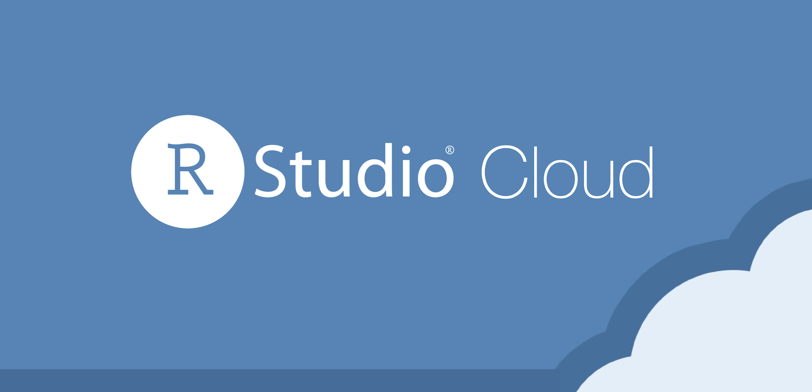

---
output:
  html_document:
    toc: no
    toc_depth: 2
    toc_float: yes
    code_folding: hide
    theme: flatly
---


```{r setup, include=FALSE}
knitr::opts_chunk$set(echo = TRUE, comment = NA)

c1 ="#3B566E"  # azul oscuro- color primario 
c2 ="#6487A5"  # azul claro- color secundario
c3 ="#2ED199"  # verdeclaro - color terciario
c4 ="#F2F2F2"  # gris muy claro - color texto
c5 ="#8DA9C4"  # azul claro 
c6= "#04BA80"  # verde claro
c7= "#0E9183"  # verde oscuro
```


<br/><br/>

<br/><br/>

# **Introducción a R - RStudio**

<br/><br/>


```{r, echo=FALSE, out.width="15%", fig.align='left'}
knitr::include_graphics("img/logoR.png")
```

<br/><br/>

# **Que es R** 

<br/>

Es un lenguaje para la computación  estadística, utilizado para el procesamiento de información y generación de modelos estadísticos. Entre las principales caractarísticas  estan:

   + Licencia (GNU GPL)  abierta y gratis
   
   + Creciente popularidad en ciencia de datos

   + Multipalataforma (UNIX, Windows, MacOS)

   + Ross Ihaka y Robert Gentieman (U.Auckland - Nueva Zelanda) 1993

   + Lenguaje multiparadigma
   
   + Codigo construido en C y Fortran
   
   + Gran comunidad muy activa 
   
   + Mas de 7000 paquetes 
   
<br/><br/>

```{r, echo=FALSE, out.width="50%", fig.align = "center"}
knitr::include_graphics("img/Rt.png")
```

<br/>

En el siguiente enlace se pueden obtener los archivos para su instalación : https://www.r-project.org/

<br/><br/><br/>


```{r, echo=FALSE, out.width="20%", fig.align ='left'}
knitr::include_graphics("img/logoRStudio.png")
```

<br/>

Podemos usar este lenguaje utilizando una terminal o mediante la IDE **RStudio**, la cual integra un conjunto de herramientas que facilitan el uso R a los usuarios 


Esta interfaz esta conformada por varias ventana como se muestra en la siguiente imagen

<br/>

```{r, echo=FALSE, out.width="100%", fig.align = "center"}
knitr::include_graphics("img/VRStudio.png")
```

<br/>

1. Fuente (Source) : Ventana donde se trabajan los script  con código que se guardan para posterior utilización

2. Consola (Console) : Ventana donde se pueden escribir comandos de manera directa

3. Ambiente (Environment) : Ventana donde se pueden observar las varables y objetos creados

4. Archivos (Files) : Ventana que muestra el directorio y los archivos en el que estamos trabajando

5. Graficos (plots) : Ventana que presenta los gráficos construidos

6. Paquetes (Packages) : Ventana que permite instalar los paquetes requeridos

7. Ayudas (Help) : Ventana en la que podemos pedir ayuda sobre las sintaxis de funciones

<br/><br/>

En los siguientes enlaces se pueden descargar los programas :

+ [R download](https://cran.r-project.org/)

+ [RStudio download](https://rstudio.com/products/rstudio/download/)


<br/><br/><br/>

## **RStudio Cloud**

```{r, echo=FALSE, out.width="30%", fig.align ='left'}

```

<br/>

**RStudio Cloud** es una plataforma online que te permite realizar análisis de datos y desarrollo de software en RStudio, sin necesidad de instalar software o configurar tu propio entorno. Puedes acceder a ella desde cualquier navegador web, lo que la convierte en una opción ideal para quienes no tienen un ordenador potente o que necesitan trabajar en equipo.

<br/><br/>

### **Ventajas**

* **Accesibilidad:** Puedes acceder a RStudio Cloud desde cualquier lugar con conexión a internet.

* **Facilidad de uso:** No necesitas instalar software ni configurar tu propio entorno.

* **Potente:** Ofrece acceso a una amplia gama de herramientas de análisis de datos y desarrollo de software.

* **Colaboración:** Puedes compartir tus proyectos con otros usuarios y trabajar en ellos de forma colaborativa.

<br/><br/>

## **Instalación**

<br/>

Al ser una plataforma online, no hay que instalar RStudio Cloud en tu ordenador. Solo tienes que seguir estos pasos:

<br/>

#### **Creación de una cuenta en RStudio Cloud**

1. Crea una cuenta gratuita en https://posit.cloud/.
2. Elige un plan que se ajuste a tus necesidades. Hay planes gratuitos y de pago.
3. Inicia sesión en RStudio Cloud.
4. Crea un nuevo proyecto o abre un proyecto existente

<br/>

Una vez que hayas creado un proyecto, puedes empezar a trabajar en él de inmediato. RStudio Cloud te ofrece una interfaz similar a la de RStudio Desktop, por lo que te resultará familiar si ya has utilizado RStudio antes.

<br/>

Para ejecutar código R, simplemente escribe el código en el editor de código y haz clic en el botón "Ejecutar". También puedes usar los atajos de teclado de RStudio para ejecutar código.

<br/><br/>

### **Clonar un repositorio de GitHub en RStudio Cloud**


**En GitHub:**

* Accede al repositorio que deseas clonar.
* Copia la URL del repositorio. Puedes encontrarla en la barra de direcciones del navegador. (https://github.com/dgonxalex80/seminarioML.git)

**En RStudio Cloud:**

* Inicia sesión en tu cuenta de RStudio Cloud.
* Haz clic en "Nuevo proyecto".
* Selecciona la opción "Desde Git".
* Pega la URL del repositorio que copiaste en el campo "URL del repositorio".
* Introduce un nombre para tu proyecto - opciopnal.
* Haz clic en "Clonar".
