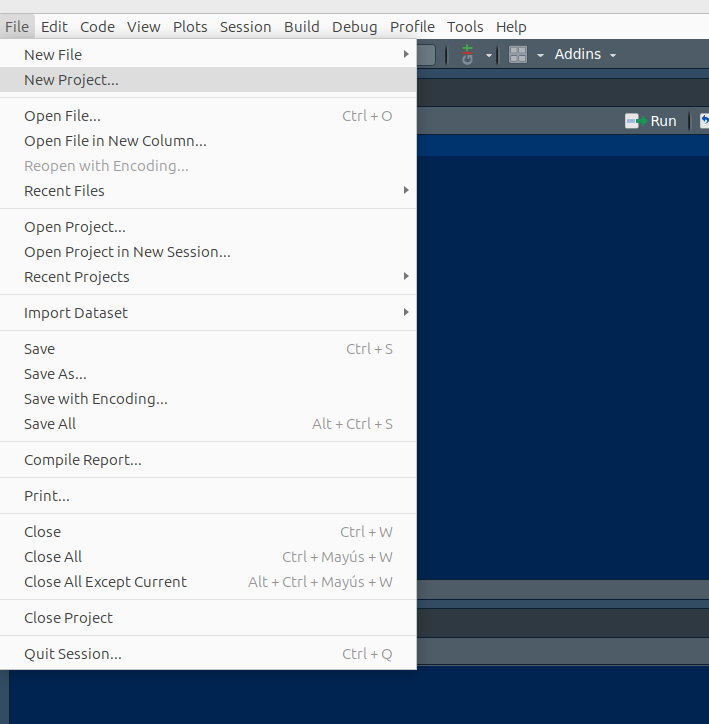

---
output:
  html_document:
    toc: no
    toc_depth: 2
    toc_float: yes
    code_folding: hide
    theme: flatly
---


```{r setup, include=FALSE}
knitr::opts_chunk$set(echo = TRUE, comment = NA)

c1 ="#3B566E"  # azul oscuro- color primario 
c2 ="#6487A5"  # azul claro- color secundario
c3 ="#2ED199"  # verdeclaro - color terciario
c4 ="#F2F2F2"  # gris muy claro - color texto
c5 ="#8DA9C4"  # azul claro 
c6= "#04BA80"  # verde claro
c7= "#0E9183"  # verde oscuro
```


<br/><br/>

<br/><br/>

# **Construcción de un proyecto en R**

Es recomendable construir proyecto en R antes de empezar un trabajo. Esto grantiza que todos los archivos (datos, programas, imagenes..) queden conectados y ubicados en una misma carpeta


<br/><br/>


```{r, echo=FALSE, out.width="50%", fig.align='left'}

```

<br/><br/>


