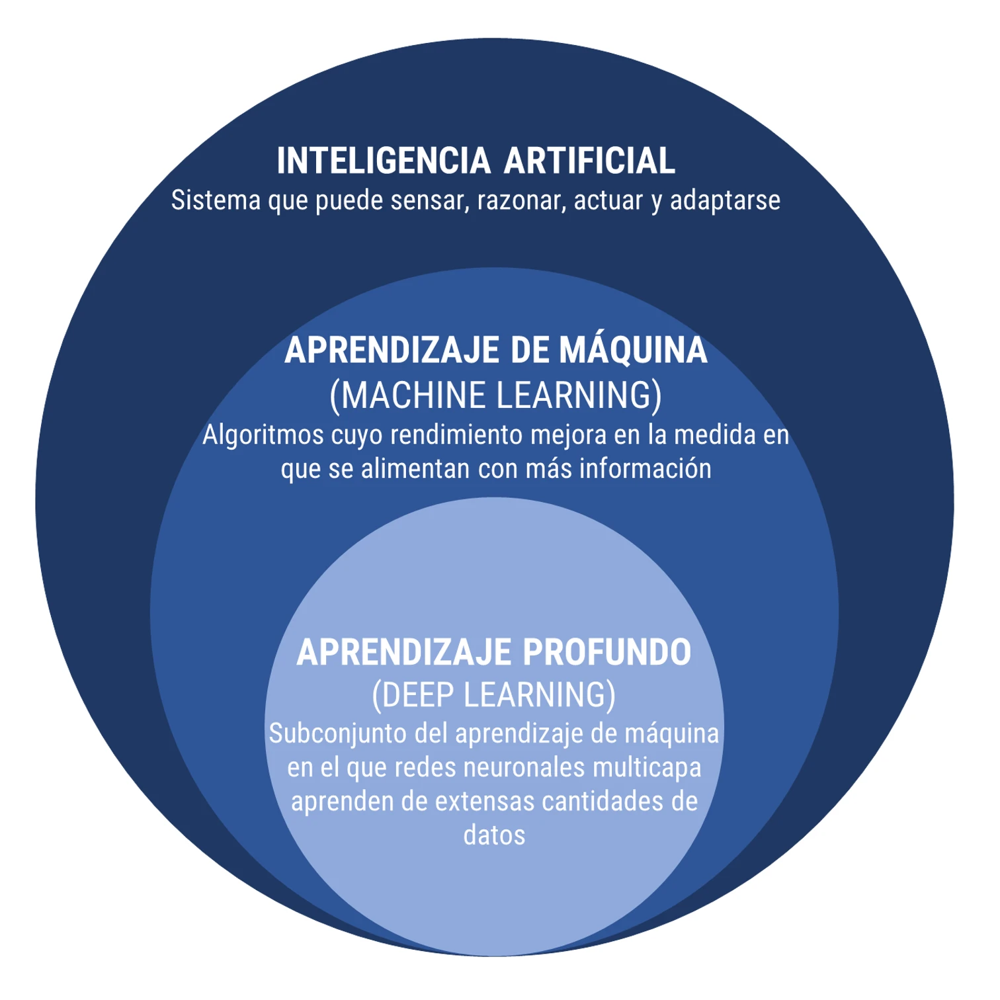

---
output:
  html_document:
    toc: no
    toc_depth: 2
    toc_float: yes
    code_folding: hide
    css: style.css
---


```{r setup, include=FALSE}
knitr::opts_chunk$set(echo = TRUE, comment = NA)

c1 ="#3B566E"  # azul oscuro- color primario 
c2 ="#6487A5"  # azul claro- color secundario
c3 ="#2ED199"  # verdeclaro - color terciario
c4 ="#F2F2F2"  # gris muy claro - color texto
c5 ="#8DA9C4"  # azul claro 
c6= "#04BA80"  # verde claro
c7= "#0E9183"  # verde oscuro
```


```{r, echo=FALSE, out.width="100%", fig.align = "center"}

```

<br/><br/>


```{r, echo=FALSE, out.width="70%", fig.align = "center"}

```

<br/><br/>

<div class="content-box-blue">

## **Inteligencia Artificial**

La inteligencia artificial (IA) se refiere a la capacidad de las máquinas o sistemas informáticos para realizar tareas que normalmente requieren inteligencia humana. Esto incluye procesos como el razonamiento, el aprendizaje, la percepción visual, el reconocimiento del lenguaje natural y la toma de decisiones. La IA se divide en dos categorías principales: la IA débil, que se centra en tareas específicas, y la IA fuerte, que busca replicar la inteligencia general humana.

Russell, S., & Norvig, P.(2010), "Artificial Intelligence: A Modern Approach", Prentice Hall.

</div>

<br/><br/>

<div class="content-box-blue">
## **Aprendizaje de Máquinas (Machine Learning) **

El aprendizaje de máquinas es una rama de la inteligencia artificial que se ocupa del desarrollo de algoritmos y modelos que permiten a las máquinas mejorar su rendimiento en tareas específicas a través de la experiencia. En lugar de utilizar programación explícita, las máquinas aprenden patrones y reglas a partir de datos, permitiendo la toma de decisiones y la realización de tareas sin intervención humana constante.

Bishop, C. M.(2006), "Pattern Recognition and Machine Learning", Editorial: Springer.

</div>

</br><br/>


<div class="content-box-blue">

## **Aprendizaje Profundo (Deep Learning)**

El aprendizaje profundo es una subcategoría del aprendizaje de máquinas que utiliza arquitecturas de redes neuronales profundas para modelar y resolver problemas complejos. Estas redes, también conocidas como redes neuronales profundas, están compuestas por múltiples capas de nodos y se destacan por su capacidad para aprender automáticamente representaciones jerárquicas de datos, lo que ha llevado a avances significativos en áreas como la visión por computadora, el procesamiento del lenguaje natural y más.

Goodfellow, I., Bengio, Y., Courville, A., & Bengio, Y. (2016), "Deep Learning", MIT Press.

</div>

<br/><br/>

<div class="content-box-blue">

## **Ciencia de Datos**

La ciencia de datos es un campo interdisciplinario que utiliza métodos científicos, procesos, algoritmos y sistemas para extraer conocimiento y percepciones valiosas a partir de datos estructurados y no estructurados. Combina técnicas de estadísticas, matemáticas, programación y dominio del tema para analizar conjuntos de datos y proporcionar soluciones informadas a problemas complejos.

Dhar, V. (2013), "Data science and prediction"

</div>

<br/><br/>

<div class="content-box-blue">

## **Minería de Datos**

La minería de datos, en el contexto de la ciencia de datos, se refiere al proceso de aplicar técnicas y algoritmos de análisis de datos para descubrir patrones, tendencias y conocimientos ocultos en grandes conjuntos de datos. Este campo utiliza métodos estadísticos, técnicas de aprendizaje automático y herramientas de inteligencia artificial para explorar datos estructurados y no estructurados, con el objetivo de proporcionar percepciones valiosas que pueden ser utilizadas en la toma de decisiones.

En el marco de la ciencia de datos, la minería de datos es una fase clave que aprovecha diversas metodologías, incluyendo el aprendizaje de máquinas, para identificar información relevante y conocimiento accionable. La ciencia de datos aborda la recopilación, preparación y análisis de datos en general, mientras que la minería de datos se centra específicamente en la extracción de patrones y conocimientos útiles.

Han, J., Kamber, M., & Pei, J. (2011),"Data Mining: Concepts and Techniques", Morgan Kaufmann.
Dhar, V. (2013), "Data science and prediction", Communications of the ACM, 56(12), 64-73.

</div>

<br/><br/>

<div class="content-box-blue">
## **Aprendizaje Automático**

El aprendizaje automático es una rama de la inteligencia artificial que se enfoca en el desarrollo de algoritmos y modelos que permiten a los sistemas informáticos aprender patrones y realizar tareas sin ser programados explícitamente. Se basa en la capacidad de las máquinas para mejorar su rendimiento a medida que se exponen a más datos, permitiendo la toma de decisiones automatizada y la adaptación a situaciones cambiantes.

Mitchell, T. M. (1997) "Machine Learning", Editorial: McGraw-Hill.

</div>


<br/><br/><br/><br/>


