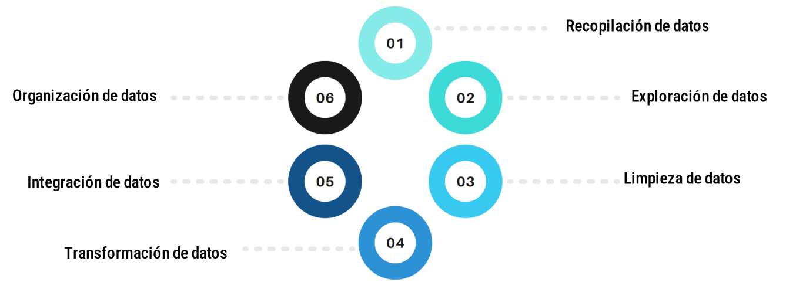

---
output:
  html_document:
    toc: no
    toc_depth: 2
    toc_float: yes
    code_folding: hide
    css: style.css
---


```{r setup, include=FALSE}
knitr::opts_chunk$set(echo = TRUE, comment = NA)

c1 ="#3B566E"  # azul oscuro- color primario 
c2 ="#6487A5"  # azul claro- color secundario
c3 ="#2ED199"  # verdeclaro - color terciario
c4 ="#F2F2F2"  # gris muy claro - color texto
c5 ="#8DA9C4"  # azul claro 
c6= "#04BA80"  # verde claro
c7= "#0E9183"  # verde oscuro
```


```{r, echo=FALSE, out.width="100%", fig.align = "center"}

```

<br/><br/>


La preparación de datos es una fase crucial en el proceso de minería de datos y ciencia de datos. Esta etapa implica 


```{r, echo=FALSE, out.width="100%", fig.align = "center"}

```


<br/><br/>

Para que sean adecuados y útiles en el momento de realizar el análisis de los mismos. 

En esta unidad se presentarán los aspectos principales del proceso de preparación de datos que está enmarcado dentro del ciclo de los datos en ciencia de datos y continuaremos la exploración inicial de los datos.


